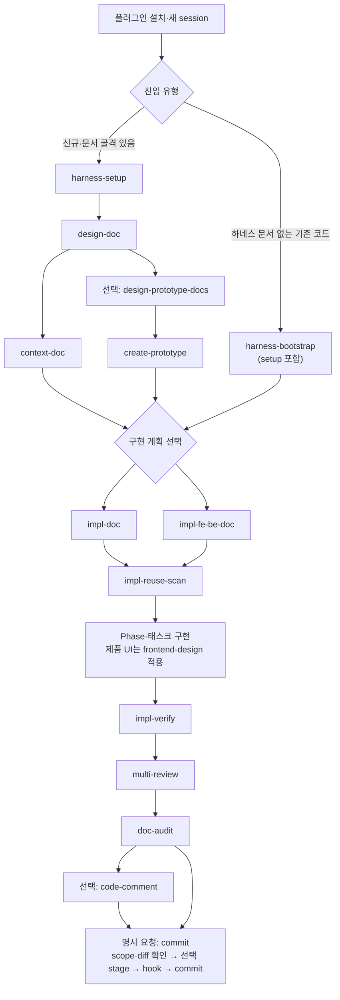
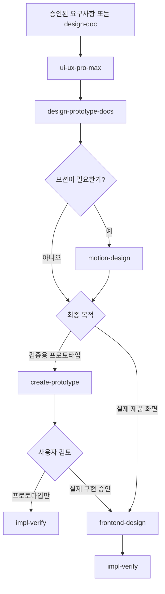

# Harness Kit Engineering Guide

> 기준일: 2026-08-03
> 이 문서는 `harness-kit` 플러그인의 **실제 프로젝트 사용자 런북**과
> **관리 저장소 운영 계약**을 함께 설명하는 현행 정본이다.

설치 명령과 Codex·Claude CLI/App별 증적 절차는
[Plugin Installation Guide](./Plugin_Installation_Guide.md)를 따른다. 이 문서는
설치 이후 어떤 순서로 설계·구현·검증하고, 관리자가 그 흐름을 어떻게 유지하는지에
집중한다.

---

# 제1부. 사용자용 — 프로젝트 수행 런북

## 1. 목적과 기본 원칙

AI Agent Harness는 Codex, Claude Code처럼 서로 다른 에이전트가 같은
프로젝트에서 같은 문서·구현·품질 기준으로 일하도록 만드는 작업 체계다.

핵심 원칙은 다음과 같다.

1. **플러그인으로 시작한다.** 실제 프로젝트는 이 관리 저장소를 clone하거나
   스킬을 복사하지 않는다.
2. **설계가 먼저다.** 구현 전에 요구사항, 범위, 아키텍처, 완료 기준을 문서로
   고정한다.
3. **에이전트가 읽을 고정 맥락을 만든다.** 단일 앱은 루트 `AGENTS.md`를
   공용 정본으로 쓰고, 복수 앱은 `.docs/root-context/AGENTS.md`를 Git 관리
   원본으로 두며 루트 `AGENTS.md`는 실행용으로 갱신한다. 세부 규칙은
   `.docs/**/instruction/`으로 분리한다.
4. **구현은 작은 단위로 쪼갠다.** Phase, 태스크, 화면, 기능 단위로 구현하고
   각 단위가 끝날 때 검증한다.
5. **문서와 코드를 함께 관리한다.** 코드가 달라지면 설계·컨텍스트·구현 계획의
   괴리를 확인한다.
6. **품질 확인을 앞당긴다.** 구현 직후 검증·리뷰하고, 커밋은 그 다음에 한다.
7. **문서 개선은 승인형이다.** Markdown producer는 구조 검증 뒤 개선안을
   제안하고, 승인된 변경만 반영한 뒤 다시 검증한다.
8. **프로젝트에는 사용자 스킬을 복사하지 않는다.** 스킬 버전과 양 플랫폼
   배포는 설치된 플러그인이 담당한다.

## 2. 설치 이후의 책임 경계

| 영역 | 담당 | 프로젝트에 남는가 |
|------|------|-------------------|
| 현행 사용자 스킬 정본 19종 | 관리 저장소 `skills/` | 다음 plugin build의 입력 |
| 현재 `0.3.1` runtime 19종 | 설치된 `harness-kit` 플러그인 | local copy를 남기지 않음 |
| 프로젝트 문서 골격 | 프로젝트 수행자가 `harness-setup`으로 생성 | `.docs/**`, `AGENTS.md`, `CLAUDE.md` |
| 설계·구현 계획·프로토타입 | 프로젝트 수행자와 사용자 스킬 | `.docs/**` |
| 코드·테스트 산출물 | 프로젝트 수행자 | 각 앱 repo |
| 리뷰·검증 보고 | 프로젝트 수행자와 사용자 스킬 | 기본은 대화 보고, 스킬이 별도 파일 생성을 금지하면 repo에 저장하지 않음 |
| 플러그인 build·upstream 최신화 | 하네스 관리자 | 이 관리 저장소 |

Phase 5에서 `pre-commit`을 제거한 source inventory와 `0.3.1` generated runtime은
모두 19종이다. 이전 `0.2.2` archive는 historical immutable artifact로만 보존한다.

`harness-setup`의 쓰기 allowlist는 `.docs/**`, 루트 `AGENTS.md`,
`CLAUDE.md`다. `.agents/skills/**`, `.claude/skills/**`, `skills/**`를
생성·복사·동기화하지 않는다. 실행 전에 존재하던 local skill 경로는 읽기
전용으로 분류·보고하고 승인 없이 변경하지 않는다.

공유 runtime의 `allowed-tools`에는 제한 없는 `Bash`를 사전 승인하지 않는다.
shell 명령은 각 플랫폼의 일반 permission mode를 따르며, 커밋·Git 설정·작업
지침 명령 실행처럼 부작용이 있는 스킬은 사용자가 명시 호출한다.

## 3. 시작 전에 결정할 것

### 3.1 입력 상태

| 현재 상태 | 진입점 |
|-----------|--------|
| 아이디어나 내부 요구사항만 있음 | `design-doc` |
| RFP·SFR·기획 문서가 있음 | 파일이나 내용을 `design-doc`, `design-prototype-docs`, 다중 화면·페어 다중 기능용 `impl-fe-be-doc`에 직접 제공 |
| 문서 없는 기존 코드베이스 | `harness-bootstrap` |
| 설계·컨텍스트는 있고 새 기능을 시작함 | `impl-doc` 또는 `impl-fe-be-doc` |
| 구현 계획이 있고 Phase를 시작함 | `impl-reuse-scan` 후 구현 |
| Phase 구현이 끝남 | `impl-verify` |
| 커밋을 준비함 | `multi-review` → `doc-audit` → 선택 `code-comment`·재검증 → 사용자가 `commit` 명시 호출 |

`rfp-ingest`는 제거됐다. RFP는 별도의 중간 스킬을 거치지 않고 명시적으로
RFP 원문 해석을 지원하는 producer에 직접 입력한다. 단일·소규모 `impl-doc`은
승인된 설계나 PRD를 입력으로 삼는다.

### 3.2 단일 앱과 복수 앱

**단일 애플리케이션**은 앱 repo 안에서 코드와 하네스 문서를 함께 관리한다.

```text
my-app/
├── .docs/
├── AGENTS.md
├── CLAUDE.md
└── src/
```

**복수 애플리케이션**은 프로젝트 최상위 폴더 아래 앱 repo들과 공용 `.docs`
repo를 분리하는 것을 권장한다.

```text
my-project/              ← 보통 git 미관리
├── app-frontend/        ← 별도 git repo
├── app-backend/         ← 별도 git repo
├── .docs/               ← 별도 git repo 권장
├── AGENTS.md            ← 실행용
└── CLAUDE.md            ← AGENTS.md bridge
```

복수 앱에서 `.docs/root-context/AGENTS.md`가 루트 컨텍스트의 관리 원본이다.
루트 `AGENTS.md`와 `CLAUDE.md`는 실행용이다. 기존 `.docs` repo가 있다면 빈
골격을 새로 만들기 전에 올바른 위치에 clone/pull해서 복원한다.

### 3.3 작업 규모

작업 규모는 문서의 깊이와 Phase 크기를 결정한다.

| 규모 | 예시 | 운영 방식 |
|------|------|-----------|
| 소규모 | 단일 API, 컴포넌트 하나, 작은 스크립트 | 짧은 설계와 `impl-doc`, 태스크 단위 검증 |
| 중규모 | 한 기능의 FE 또는 BE, 여러 파일의 모듈 | 명시적 Phase와 재사용 점검 |
| 대규모 | FE/BE 페어, 다중 화면, RFP 기능군 | 상세 설계, `impl-fe-be-doc`, Phase별 사용자 확인 |

### 3.4 구현 계획 축

| 질문 | `impl-doc` | `impl-fe-be-doc` |
|------|------------|------------------|
| 중심 단위 | 단일 기능·모듈·입출력 파이프라인 | FE/BE 페어 또는 화면 |
| 적합 대상 | 단일 BE/FE 기능, CLI, 배치, 스크립트, 라이브러리 | 풀스택 다중 기능, 다중 화면, RFP/SFR 화면 |
| Phase 완료 기준 | 해당 기능이나 입출력 결과가 검증됨 | 연결된 FE/BE 또는 화면 하나가 검증됨 |

FE/BE 페어 다중 기능을 함께 끝내거나 여러 화면의 흐름을 다루면
`impl-fe-be-doc`을 쓴다. 화면 1개, API 1~수개, 단일 full-stack 기능을 포함한
단일·소규모 범용 작업은 `impl-doc`을 쓴다.

## 4. 설치와 초기 세팅

### 4.1 플랫폼별 명시 호출

| 인터페이스 | 설치 후 첫 호출 |
|------|----------------|
| Codex CLI·앱 | `$harness-setup` |
| Claude Code CLI·Claude 앱 | `/harness-kit:harness-setup` |

Codex는 설치 후 새 task를 열고 필요하면 앱을 재시작한다. Claude Code는
`/reload-plugins` 후 새 session에서 확인한다. 스킬이 보인다는 사실은 설치
성공의 증거지만, 실제 산출물 계약을 지켰다는 증거는 아니다.

### 4.2 `harness-setup` 확인 순서

1. 대상 프로젝트 루트를 확정한다.
2. 단일 앱인지 복수 앱인지 판정한다.
3. 신규 세팅인지 기존 `.docs`의 갱신·복구인지 판정한다.
4. 생성·갱신 예정 경로를 미리 확인한다.
5. `.docs` 안내·정책 파일과 루트 컨텍스트를 만든다.
6. 링크, bridge, 앱별 context 참조를 검증한다.
7. Markdown bundle의 문서 개선안을 검토한다.
8. 프로젝트 local skill 경로를 만들지 않았는지 확인한다.

`harness-setup`은 플러그인 설치기나 스킬 동기화기가 아니다. 사용자 스킬
directory가 생겼다면 정상 결과로 보지 않는다.

### 4.3 `.docs` 초기 골격과 진행 후 구조

`harness-setup` 직후에는 `.docs/README.md`, `.docs/.gitignore`,
`.docs/_inbox/`, 루트 컨텍스트 골격을 만든다. 복수 앱이면 빈 앱별 context와
instruction 디렉터리, `.docs/root-context/`도 준비한다.

아래 트리는 `design-doc`, `context-doc`, `impl-*`, prototype producer까지
진행한 뒤의 **대표 누적 구조**다. `context-base/`, `impl-doc/`, `prototype/`,
`.harness/`가 setup만으로 모두 생긴다는 뜻은 아니다.

단일 앱의 대표 구조:

```text
.docs/
├── README.md
├── .gitignore
├── _inbox/                    ← 내용은 local 임시 입력
├── context-base/
│   └── DESIGN.md
├── instruction/
├── impl-doc/
├── prototype/
└── .harness/
    └── humanize-handoffs.json
```

복수 앱의 대표 구조:

```text
.docs/
├── README.md
├── .gitignore
├── _inbox/
├── app-frontend-context.md
├── app-frontend/
│   ├── context-base/
│   ├── instruction/
│   └── impl-doc/
├── app-backend-context.md
├── app-backend/
│   ├── context-base/
│   ├── instruction/
│   └── impl-doc/
├── prototype/
├── root-context/
│   ├── AGENTS.md
│   └── CLAUDE.md
└── .harness/
    └── humanize-handoffs.json
```

## 5. 전체 사용자 흐름



가독성을 위해 흐름도에서는 각 Markdown producer 뒤의 공통 gate를 생략했다.
`harness-setup`, `harness-bootstrap`, `design-doc`, `context-doc`,
`design-prototype-docs`, `impl-doc`, `impl-fe-be-doc`의 출력은 모두
**원 producer 검증 → 개선안·사용자 결정 → 승인 변경 반영 → 원 producer
재검증**을 거친 뒤 다음 노드로 전달한다.

### 5.1 1단계 — 설계와 컨텍스트

#### 신규·요구사항 기반

1. 요구사항, RFP, 관련 코드, 금지 범위를 `design-doc`에 제공한다.
2. 인터뷰로 모호한 요구사항과 의사결정을 정리한다.
3. OUTPUT_V2 설계 초안을 검토한다.
4. 후속 workflow에서 쓸 경우 저장을 승인한다.
5. 저장된 설계를 `context-doc`에 입력한다.
6. `AGENTS.md`, `CLAUDE.md`, 필요한 instruction 파일을 검토하고 저장한다.

`design-doc`의 기본 저장 경로:

- 단일 앱: `.docs/context-base/DESIGN.md`
- 복수 앱: `.docs/{앱}/context-base/DESIGN.md`

#### 기존 코드베이스

`harness-bootstrap`은 별도 `harness-setup` 선행 호출 없이 기존 코드의
진입점으로 직접 사용할 수 있으며, 다음 흐름을 하나의 최외곽 bundle로 묶는다.

```text
harness-setup 골격 확인
→ repository·stack·구조 스캔
→ 관찰과 사용자 답변 구분
→ design-doc OUTPUT_V2 초안
→ context-doc 산출물
→ 일괄 미리보기·승인
→ 저장·구조 검증
→ bundle당 한 번의 문서 개선 제안
```

자식 `harness-setup`, `design-doc`, `context-doc`은 같은 bundle 안에서 별도
`humanize-korean` 제안을 만들지 않는다.

#### 컨텍스트 문서

단일 앱에서 `context-doc`은 설계 내용을 다음처럼 분리한다.

| 내용 | 생성 대상 |
|------|-----------|
| 프로젝트 팩트, 디렉터리 인덱스, 실행 방법, 환경 변수 | `AGENTS.md` |
| Claude 진입점 | `CLAUDE.md`의 `@AGENTS.md` bridge |
| 모듈·레이어·의존성 | `architecture-instruction.md` |
| 네이밍·예외·주석 | `code-style-instruction.md` |
| 프레임워크·라이브러리 규칙 | `framework-instruction.md` |
| API 규약 | `api-instruction.md` |
| WebSocket·메시지큐 등 통신 | `comm-instruction.md` |
| 파일 위치·네이밍 | `file-convention-instruction.md` |
| 에이전트 전용 행동 규칙 | `agent-instruction.md` |

설계에 근거가 없는 주제 문서를 억지로 만들지 않는다.
`agent-instruction.md`는 항상 생성한다.

복수 앱에서는 프로젝트 팩트를 `.docs/{앱}-context.md`, 세부 규칙을
`.docs/{앱}/instruction/*-instruction.md`에 저장한다.
`.docs/root-context/AGENTS.md`는 루트 정본 내용의 형상관리 복사본이자
갱신 기준이며, `.docs/root-context/CLAUDE.md`는 그 bridge 복사본이다. 루트
실행용 `AGENTS.md`와 `CLAUDE.md`의 최종 갱신은 `harness-setup` 계약이 담당한다.

#### 화면을 먼저 검증할 때

```text
design-doc
→ design-prototype-docs
→ .docs/prototype/{사용자}/{식별자}/design-doc.md
→ create-prototype
→ .docs/prototype/{사용자}/{식별자}/
```

프로토타입은 요구사항과 이동 흐름을 검증하는 폐기 가능한 산출물이다. 실제 제품
코드로 그대로 승격하지 않는다.

### 5.2 2단계 — 구현 계획

1. 설계 문서와 대상 앱을 확정한다.
2. `impl-doc` 또는 `impl-fe-be-doc`을 고른다.
3. Phase별 목표, 작업 ID, 수정 예상 파일, 검증 방법, 완료 기준을 정한다.
4. 초안과 파일명을 검토한다.
5. 계획서와 roadmap index를 저장한다.
6. 원 producer 검증과 승인형 문서 개선을 마친다.
7. Phase 시작 직전에 `impl-reuse-scan`을 실행한다.

구현 계획 기본 경로:

- 단일 앱: `.docs/impl-doc/{사용자}/{YYMMDD}-{seq}.{slug}-impl-{kind}.md`
- 복수 앱:
  `.docs/{앱}/impl-doc/{사용자}/{YYMMDD}-{seq}.{slug}-impl-{kind}.md`
- 공용 index:
  `{YYMMDD}-0.{앱이름}-roadmap-impl-index.md`

두 impl 스킬은 같은 디렉터리와 index를 공유한다. 생성 스킬은 파일명 대신 문서
머리말의 `생성 스킬`로 구분한다.

`impl-reuse-scan`은 기존 공통 자산과 패턴을 후보로 보고한다. 자동 반영하지
않으므로, 사용할 후보와 사용하지 않을 후보를 사람이 결정한다.

### 5.3 3단계 — 작은 단위 구현과 검증

한 번의 작업 턴에는 하나의 Phase 또는 명확한 태스크 집합만 넣는다.

좋은 요청은 다음 네 가지를 포함한다.

- 참조해야 할 설계·컨텍스트·구현 계획
- 이번 턴의 Phase 또는 태스크 ID
- 수정 허용 파일과 금지 범위
- 실행할 검증과 완료 기준

아래 경로는 플랫폼의 파일 첨부 또는 경로 참조 기능으로 제공한다.

예시:

```text
참조 설계: .docs/context-base/DESIGN.md
참조 계획: .docs/impl-doc/developer/260730-1.user-search-impl-api.md

Phase 2의 API-03만 구현해줘.
수정 범위는 search service, controller, 관련 test로 제한한다.
공통 인증 모듈과 다른 Phase는 변경하지 말 것.
완료 후 실행한 테스트와 남은 위험을 보고해줘.
```

UI를 실제로 구현할 때는 `frontend-design`을 적용한다. 문서나 검증용 시안을
요청한 것이라면 각각 `design-prototype-docs` 또는 `create-prototype`으로
라우팅한다.

Phase가 끝나면 `impl-verify`로 계획 대비 PASS/FAIL/SKIP 매트릭스를 만든다.
이 스킬은 검증 결과를 보고하는 역할이며 계획서나 코드를 임의로 고치지 않는다.
FAIL이 있으면 사용자가 구현 또는 impl 문서 단계로 돌아간다.

### 5.4 4단계 — 품질과 커밋

권장 순서:

```text
impl-verify
→ multi-review
→ doc-audit
→ 필요한 수정과 재검증
→ 선택: code-comment
→ 사용자 명시 요청: commit
  └─ 지침·status·diff·최근 log 확인 → 의도한 파일만 stage → 정상 hook → commit·사후 증거
```

- `multi-review`: 보안, 성능, 유지보수, 테스트 네 관점의 위험을 우선순위와 함께
  보고한다.
- `doc-audit`: 코드와 문서의 괴리를 분석하고 변경 제안을 대화창에 제시한다.
  승인 전 문서를 쓰지 않는다.
- `code-comment`: 코드만 봐서는 의도와 제약을 이해하기 어려운 부분에 한글
  주석을 보강한다. 모든 줄에 설명을 붙이지 않는다.
- `commit`: 사용자가 명시 호출했을 때만 지침, staged·unstaged·untracked 범위,
  diff, 최근 log와 검증 결과를 확인한다. 기존 범위 밖 staged 변경을 보존하고
  의도한 파일만 stage한 뒤 정상 hook과 Conventional Commit을 실행하며, 완료 후
  SHA·`git show`·status·남은 변경을 확인한다.

리뷰에서 커밋으로 자동 handoff하지 않는다. commit, push, amend, tag, branch 생성은
각각 필요한 명시적 사용자 요청과 해당 확인 절차를 거친다.

## 6. Markdown producer와 `humanize-korean`

Markdown bundle을 만드는 producer는 9종이다. 고정 7종과 조건부 2종으로 나뉜다.

- `harness-setup`
- `harness-bootstrap`
- `design-doc`
- `context-doc`
- `design-prototype-docs`
- `impl-doc`
- `impl-fe-be-doc`

후처리 계약:

1. 최외곽 producer가 안정적인 `artifact_bundle_id`와 `handoff_owner`를 만든다.
2. 중첩 producer에는 같은 ID와 owner,
   `suppress_child_handoff=true`를 전달한다.
3. 원 producer가 필수 섹션, 저장 경로, 링크, index, bridge를 먼저 검증한다.
4. owner만 bundle 전체를 `humanize-korean`의 `document-refinement` profile에
   한 번 넘긴다.
5. `humanize-korean`은 개선안·변경 이유·diff를 먼저 제시한다.
6. 보호 token, 경로, 코드블록, 표, 링크, 식별자를 보존한다.
7. 사용자가 승인한 변경만 반영한다.
8. 원 producer가 원래 구조 계약을 다시 검증한다.
9. downstream 스킬은 승인·재검증된 최종 Markdown을 입력으로 사용한다.

제안, 건너뛰기, 거절, 적용, 재검증 상태 이벤트는
`.docs/.harness/humanize-handoffs.json`에 기록한다. 최종 Markdown 상대경로,
내용 SHA-256, profile로 계산한 fingerprint에 기존 결정이 있으면 새
session에서 같은 제안을 반복하지 않는다. 상태가 `proposed`라면 이미 제안이
존재함을 보고하고, 건너뛰기·거절·적용·재검증 상태는 그 결정을 재사용한다.
ledger 자체는 문서 개선 대상에서 제외한다.

사용자가 개선을 건너뛰거나 거절해도 원래 하네스 흐름은 계속된다.

## 7. 사용자 스킬 맵

| 계열 | 스킬 | 역할 |
|------|------|------|
| 설치·기반 | `harness-setup` | 프로젝트 문서 골격과 루트 컨텍스트 생성·복구 |
| 설치·기반 | `harness-bootstrap` | 기존 코드에서 설계·컨텍스트 역추출 |
| 설치·기반 | `git-scoped-account` | 상위 트리의 여러 repo에 한정된 Git 계정 설정 |
| 설계 | `design-doc` | 요구사항·아이디어·RFP 입력을 OUTPUT_V2 설계로 변환 |
| 컨텍스트 | `context-doc` | `AGENTS.md` 정본, Claude bridge, instruction 생성 |
| UI/UX 설계 | `ui-ux-pro-max` | 제품 유형·스타일·색·타이포그래피·레이아웃·접근성 결정 |
| 모션 설계 | `motion-design` | 모션 목적·타이밍·이징·안무·접근성·성능 결정 |
| 화면 설계 | `design-prototype-docs` | 프로토타입 입력용 화면 설계 문서 |
| 프로토타입 | `create-prototype` | 화면별 HTML/CSS/JS/JSON 기반 검증 시안 |
| 제품 UI | `frontend-design` | 실제 UI 구현 품질 기준 |
| 구현 계획 | `impl-doc` | 단일·소규모 범용 작업 계획 |
| 구현 계획 | `impl-fe-be-doc` | FE/BE 페어·다중 화면 작업 계획 |
| 구현 전 점검 | `impl-reuse-scan` | 재사용 후보 발견·보고 |
| 구현 검증 | `impl-verify` | Phase·태스크 검증 매트릭스 |
| 품질 | `multi-review` | 4관점 코드 리뷰 |
| 품질 | `commit` | 명시 요청에 한한 범위 확인·선택 stage·정상 hook·Conventional Commit·사후 증거 |
| 품질 | `code-comment` | 필요한 변경 코드 한글 주석 |
| 문서 | `doc-audit` | 코드·문서 괴리 분석 |
| 문서 | `humanize-korean` | Markdown 개선안과 diff |

제거된 사용자 스킬:

- `rfp-ingest`: RFP 직접 입력으로 대체
- `agent-sync`: 플러그인 배포로 대체
- `pre-commit`: 독립 scanner를 제거했다. 과거 Superpowers reference는
  `commit`에 승계하지 않으며, `commit`은 별도 `commit-workflow` 행동 계약을 따른다.

`custom-skill-design`은 반복 업무를 스킬로 만들기 위한 **관리자 스킬**이다.
프로젝트 사용자가 local custom skill을 만들도록 배포하지 않는다. 반복되는
workflow가 보이면 관리자에게 후보와 사례를 전달한다.

### 7-1. 디자인 전용 흐름

§5의 일반 흐름을 대체하지 않는다. UI 판단이 필요한 작업에서만 그 안에서 갈라져
나오는 선택적 흐름이다.



| 단계 | 입력 | 산출물 | 승인 gate | 검증 |
|---|---|---|---|---|
| `ui-ux-pro-max` | 제품 유형·업종·스택·접근성 요구 | 대화창 디자인 결정과 근거 | 저장 시 승인 필요 | 기존 토큰 우선 여부 |
| `design-prototype-docs` | 디자인 결정 또는 기존 시스템 | 화면·상태·반응형 명세 `.md` | producer gate | 7개 품질 기준 |
| `motion-design` | 모션 후보와 목적 | 모션 결정표 | 저장 시 승인 필요 | reduced-motion 대체안 필수 |
| `create-prototype` | 승인된 명세와 모션 | `.docs/prototype/**` | — | 시안·요구사항 일치 |
| `frontend-design` | 승인된 결정과 명세 | 제품 소스 | — | 기능·UI·접근성·모션 |

#### 호출·생략 조건

| 스킬 | 호출 | 생략 |
|---|---|---|
| `ui-ux-pro-max` | 디자인 방향·토큰·레이아웃을 정할 때, 기존 화면 UX·접근성 리뷰 | 백엔드 전용, 명세 확정 후 단순 구현, 문구·데이터만 수정 |
| `motion-design` | 전환·상태 피드백·등장 순서·브랜드 모션 설계, 기존 애니메이션 리뷰 | 정적 화면으로 충분, 요구사항에 모션 없음, 기존 모션 명세 그대로 적용 |

#### 공개 skill-name handoff 계약

디자인 흐름의 스킬은 서로의 내부 파일이나 상대경로를 읽지 않는다. 연결은 공개
스킬 이름으로만 한다. 내부 경로에 결합하면 상대 스킬의 리팩터링이 이쪽을 조용히
깨뜨리고, 설치된 플러그인에서는 그 경로가 해소되지도 않는다.

#### 선택적 저장 경로

두 신규 스킬의 기본 동작은 대화창 보고다. 사용자가 명시적으로 요청할 때만
저장한다.

```text
.docs/design-system/{project-slug}/MASTER.md
.docs/design-system/{project-slug}/pages/{page-slug}.md
.docs/design-system/{project-slug}/motion/{screen-or-component}.md
```

기존 파일이 있으면 diff를 제시하고 승인 전에는 덮어쓰지 않는다. 두 스킬은
조건부 Markdown producer이므로, 최외곽 생성자일 때만 `humanize-korean` 개선안을
한 번 제안한다. 색상값, 토큰 이름, duration, easing, reduced-motion 조건, 성능
budget은 문서 개선 단계의 보호 토큰이며 개선으로 값이 바뀌지 않는다.

#### 두 분기의 경계

프로토타입 산출물은 폐기 가능한 검증 자료다. **제품 소스로 복사하지 않는다.**
승인 후 실제 구현으로 넘어갈 때는 승인된 디자인 결정과 화면 명세만 전달하고,
`frontend-design`이 제품의 기존 컴포넌트·토큰·프레임워크에 맞게 다시 구현한다.
사용자가 처음부터 실제 화면을 요청하면 프로토타입 단계를 강제하지 않는다. 두
분기 모두 목적에 맞는 `impl-verify` 검증으로 끝난다.

## 8. 산출물과 형상관리

| 산출물 | 기본 위치 | 소유와 형상관리 |
|--------|-----------|----------------|
| 설계 | `.docs/**/context-base/DESIGN.md` | 프로젝트 문서 |
| 루트 컨텍스트 | `AGENTS.md`, `CLAUDE.md` | `AGENTS.md` 정본, `CLAUDE.md` bridge |
| 세부 규칙 | `.docs/**/instruction/*-instruction.md` | 프로젝트 문서 |
| 화면 설계·시안 | `.docs/prototype/{사용자}/{식별자}/` | 공용 요구사항 검증 산출물 |
| 구현 계획·index | `.docs/**/impl-doc/{사용자}/` | 구현 근거와 진행 index |
| handoff ledger | `.docs/.harness/humanize-handoffs.json` | 개선 제안 중복 방지 상태 |
| 코드·테스트 | 각 앱 repo | 앱별 형상관리 |
| 사용자 스킬 | 설치된 플러그인 | 프로젝트 repo에 복사하지 않음 |

복수 앱에서 `.docs`가 별도 repo라면 코드 commit과 문서 commit의 연결을 이슈,
작업 ID, 구현 계획 링크 등으로 남긴다. 루트 `AGENTS.md`와 `CLAUDE.md`가 git
미관리 파일이어도 `.docs/root-context/AGENTS.md`는 관리한다.

## 9. 병렬화와 hook 전략

### 병렬화해도 되는 일

- 서로 다른 앱이나 독립된 모듈의 읽기 전용 조사
- 겹치지 않는 파일 집합의 독립 검증
- 보안·성능·테스트처럼 결과를 합칠 수 있는 리뷰 관점
- 여러 앱의 manifest와 실행 명령 탐색

### 순차로 해야 하는 일

- 설계 승인 전 컨텍스트 고정
- 구현 계획 승인 전 코드 변경
- 같은 파일이나 같은 API 계약을 건드리는 작업
- producer 검증 전 `humanize-korean` 적용
- 문서 개선 반영 후 원 producer 재검증
- 실패한 `impl-verify`를 건너뛴 커밋

플랫폼의 병렬 agent 기능을 사용할 수는 있지만 특정 모델명이나 agent fork를
스킬 frontmatter에 하드코딩하지 않는다. 작은 초기 세팅은 기본적으로 순차
실행하고, 병렬화 이득과 merge 경계가 명확할 때만 분리한다.

자동 hook에는 빠르고 결정적인 검사를 둔다.

- formatter check
- lint
- type check
- 빠른 unit test
- 금지 파일·secret·대용량 파일 검사

설계 판단과 쓰기 부작용이 있는 작업은 자동 hook으로 숨기지 않는다.

- 문서 구조 변경
- 의존성 추가
- migration 실행
- `doc-audit` 제안 반영
- commit과 push

## 10. AI 코딩 운영 원칙

### 10.1 환경을 역할에 맞게 쓴다

- 대화형 설계·정책 합의: 충분한 문맥을 볼 수 있는 task/session
- 저장소 분석·구현·검증: 실제 프로젝트 파일과 명령에 접근하는 coding agent
- 앱 인터페이스 검증: 실제 설치된 Codex/Claude 앱의 새 session

웹 대화에서 합의한 내용도 최종적으로 프로젝트 문서에 고정하지 않으면 다음
session의 기준이 되지 않는다.

### 10.2 대화 단위를 작게 유지한다

나쁜 요청:

```text
로그인, 관리자 화면, API, 배포까지 전부 만들어줘.
```

좋은 요청:

```text
구현 계획의 Phase 1, BE-02와 관련 테스트만 수행해줘.
인증 공통 모듈과 다른 Phase는 변경하지 말 것.
완료 후 수정 파일, 실행한 검증, 남은 위험을 보고해줘.
```

### 10.3 문서는 고정물이 아니라 변경 계약이다

코드가 설계와 달라졌다면 둘 중 하나를 선택해야 한다.

1. 코드가 잘못됐으면 코드가 설계를 따르게 한다.
2. 설계 결정이 바뀌었으면 `design-doc`과 `context-doc`을 갱신한다.

오래된 문서를 그대로 두는 제3의 선택은 다음 에이전트에게 잘못된 맥락을 준다.

### 10.4 컨텍스트 오염 신호를 알아챈다

다음 신호가 보이면 현재 턴을 더 키우지 말고 범위를 다시 고정한다.

- 이미 끝난 Phase의 파일을 반복해서 고친다.
- 참조하지 말라고 한 예전 문서를 다시 기준으로 삼는다.
- 단일 앱과 복수 앱 경로를 섞는다.
- prototype 코드를 제품 코드로 간주한다.
- `AGENTS.md`와 실제 instruction 링크가 어긋난다.
- 검증 실패를 설명 없이 무시한다.

새 task/session을 열 때는 설계, 컨텍스트, 현재 구현 계획, 정확한 태스크 ID를
다시 제공한다.

### 10.5 반복 workflow는 관리자 개선 후보로 남긴다

같은 프롬프트, 같은 검사, 같은 템플릿 수정이 반복되면 다음을 기록한다.

- 반복되는 입력과 출력
- 성공·실패 사례
- 필요한 도구와 권한
- 보호해야 할 템플릿·스크립트·산출물

프로젝트 안에 임시 사용자 스킬을 복제하는 대신 관리자에게
`custom-skill-design` 또는 기존 스킬 개선 후보로 전달한다.

## 11. 실행·검증 치트시트

프로젝트의 `AGENTS.md`와 package/build 설정에 적힌 명령이 항상 우선이다.

| 확인 대상 | 대표 확인 |
|-----------|-----------|
| Git 범위 | `git status --short`, `git diff`, `git diff --check` |
| JavaScript/TypeScript | `package.json`의 lint, test, typecheck, build script |
| Java | wrapper가 있으면 `mvnw`/`gradlew`의 test·package |
| Python | 프로젝트가 고정한 formatter, type checker, test runner |
| 문서 | 링크·index·bridge·경로, Markdown 구조 |
| 다중 앱 | 앱별 repo status와 공용 `.docs` status를 각각 확인 |

명령이 없거나 실행 환경이 불완전하면 임의의 새 표준을 만들지 말고 SKIP 이유와
남은 검증을 보고한다.

## 12. 사용자 체크리스트

### 프로젝트 최초 도입

- [ ] Codex 또는 Claude에 사용자 플러그인을 설치했다.
- [ ] 새 task/session에서 명시 호출이 보인다.
- [ ] 대상 프로젝트 루트와 단일/복수 앱 유형을 확인했다.
- [ ] 기존 `.docs` repo가 있다면 먼저 복원했다.
- [ ] `harness-setup` 출력이 allowlist 안에만 있다.
- [ ] local user skill directory가 새로 생기지 않았다.
- [ ] `AGENTS.md`가 정본이고 `CLAUDE.md`가 bridge다.

### 기능 시작

- [ ] 요구사항·RFP·관련 코드를 설계 입력에 직접 제공했다.
- [ ] 기존 코드라면 `harness-bootstrap`의 관찰과 추정을 구분했다.
- [ ] 설계와 컨텍스트의 변경 승인을 마쳤다.
- [ ] `impl-doc`과 `impl-fe-be-doc` 중 맞는 축을 골랐다.
- [ ] 문서 개선과 원 producer 재검증을 마쳤다.
- [ ] Phase 시작 전 재사용 후보를 점검했다.

### Phase 완료

- [ ] 구현 범위가 계획의 태스크와 일치한다.
- [ ] `impl-verify`의 FAIL을 처리했다.
- [ ] 보안·성능·유지보수·테스트 리뷰를 확인했다.
- [ ] 코드와 문서의 괴리를 확인했다.
- [ ] 커밋 전 검사를 통과했다.
- [ ] commit 범위와 메시지가 실제 변경을 설명한다.

---

# 제2부. 관리자용 — 저장소·upstream·플러그인 운영

## 13. 정본 구조와 관리자 역할

| 구분 | 수 | 정본 | 생성물 또는 대상 |
|------|---:|------|-------------------|
| 사용자 스킬 | 19 | `skills/` | `plugins/harness-kit/**` |
| 관리자 스킬 | 3 | `maintainer/skills/` | `.agents/skills/`, `.claude/skills/` |
| upstream·provenance | - | `maintainer/upstreams/` | registry, lock, 비교·반영 증적 |
| plugin metadata | - | `maintainer/inventory/`, `maintainer/plugin/` | manifest, catalog, release 증적 |

관리자 스킬:

| 스킬 | 역할 |
|------|------|
| `custom-skill-design` | Anthropic `skill-creator`를 `adapted` 원본으로, OpenAI Codex 공식 `skill-creator`를 직접 `reference`로 사용해 새 스킬 설계·생성·검증. portfolio provenance는 선택한 Superpowers 스킬 작성 원칙도 별도 `reference`로 추적 |
| `skill-portfolio-maintainer` | 외부 공식·유명 스킬 탐색, integration mode 분류, provenance와 보호 자산 영향 관리 |
| `harness-plugin-maintainer` | 플러그인 build, validate, 설치 인터페이스 증적, release gate |

별도의 관리자 플러그인은 만들지 않는다. 관리자는 repo-local projection을
사용하고, 사용자 경험을 검증할 때 일반 사용자 플러그인을 격리 설치한다.

projection은 직접 편집하지 않는다.

```text
maintainer/skills/ 정본 수정
→ sync_manager_projections.py
→ .agents/skills/와 .claude/skills/ 생성
→ --check로 drift 검증
```

projection에는 관리자 3종만 있어야 하며 `harness-setup`을 포함한 사용자 스킬은
들어가면 안 된다.

## 14. 외부 upstream lifecycle

upstream integration mode는 네 가지다.

| mode | 의미 | 정본 문서 |
|------|------|-----------|
| `native` | 외부 upstream 관계가 없는 로컬 스킬 | registry |
| `reference` | 원칙·workflow·아이디어만 참고하고 원문 자산은 배포하지 않음 | [개념·행동 참조](./Skill_Upstream_Governance.md#concept-behavior-references) |
| `adapted` | upstream 콘텐츠를 번역·수정·재구성함 | [직접 반입·변형 provenance](./Skill_Upstream_Governance.md#direct-import-provenance) |
| `vendored` | upstream 파일을 원문 그대로 복사함 | [직접 반입·변형 provenance](./Skill_Upstream_Governance.md#direct-import-provenance) |

증거가 부족한 관계는 `unknown` 차단 상태로 두며, 해소 전에는 반입하거나
릴리스하지 않는다.

현재 활성 `vendored` 관계는 없다. `humanize-korean`, `frontend-design`,
`custom-skill-design`, `ui-ux-pro-max`, `motion-design`의 원본 관계는
`adapted`이며, 별도의 공식·유명 출처를 `reference`로 함께 추적할 수 있다.

### 14-1. 하나의 upstream을 두 관계로 추적하기

같은 저장소를 직접 반입과 참고로 동시에 쓸 수 있다. `ui-ux-pro-max`와
`motion-design`이 이 구조다.

| 관계 | 모드 | 대상 | 패키징 |
|---|---|---|---|
| `{source}-runtime` | `adapted` | 신규 독립 스킬 | 포함 |
| `{source}-principles` | `reference` | 기존 디자인·검증 스킬 | 미포함 |

두 관계는 `relationship_group`으로 묶인다. 그룹 안에서는 저장소 URL,
`source_url`, `license_spdx`, `lifecycle`, observed·accepted SHA가 모두 일치해야
한다. 한쪽만 새 SHA로 승격하거나 한쪽만 `active`로 바꾸면 검증이 실패한다.
`reference` 관계가 packaged notice를 주장하거나 file-map에 `reference-only`가
아닌 treatment를 쓰면 역시 실패한다.

참고 관계는 파일을 복사하지 않으므로 `licenses/` 패키징 대상이 아니다. 외부
문장·표·체크리스트·코드를 복사해야 한다고 판단되면 그 파일은 `reference`가
아니라 `adapted` 재분류 대상이다.

upstream 최상위 라이선스는 upstream 저작자가 보유하지 않은 제3자 권리까지
허가하지 못한다. 외부 가이드라인 값이나 표를 인용한 파일은 원 저작자와 이용
조건을 파일 단위로 판정해 provenance NOTICE에 기록한다.

### 14-2. 별도 설치 대상

다음은 이 플러그인에 포함하지 않는다. 필수 의존성이 아니며 사용자가 필요할 때
원본 안내에 따라 직접 설치한다.

| 프로젝트 | 성격 | 포함하지 않는 이유 |
|---|---|---|
| [Caveman](https://github.com/JuliusBrussee/caveman) | 응답 표현·토큰 사용 방식 변경 | 하네스의 설계·검증 계약과 목적이 다르다 |
| [Ruflo](https://github.com/ruvnet/ruflo) | 다중 에이전트·메모리·MCP·hook 메타 하네스 | 일부만 복제하면 원본 이점은 사라지고 유지보수 부담만 남는다 |

설치 명령은 바뀌므로 이 문서에 복제하지 않는다. 최신 설치 방법은 각 원본
저장소의 안내를 따른다.

공통 최신화 흐름:

```text
inventory
→ discover·check (읽기 전용)
→ analyze
→ propose
→ 일반 승인
→ 격리된 maintainer/upstreams/staging/{candidate_id}/에 stage
→ 보호 자산 추가·수정·보완 승인
→ 파괴적 변경이 있으면 별도 destructive 승인
→ validate
→ candidate 한 건씩 promote
→ machine-readable promotion handoff
→ 영향받는 정본·registry·lock·provenance·문서 갱신
→ harness-plugin-maintainer build·skill eval·release regression
```

같은 최신화 workflow를 사용해도 `reference`는 원문과 동일 동작을 보장하지
않는다. `adapted`도 번역·수정된 로컬 목적을 함께 검증해야 하며, `vendored`만
원문 파일·runtime 재현성 검증 대상이다. 어느 mode도 검증하지 않은 upstream
전체 runtime 동등성을 자동 주장하지 않는다. 검증한 범위와 미검증 범위를
분리해 기록한다.

`template.md`, `templates/`, `script/`, `scripts/`, `asset/`, `assets/`,
`example/`, `examples/`, `evals/`는 보호 자산이다. 내용 보완과
삭제·이동·교체를 같은 변경으로 취급하지 않는다. 파괴적 변경은 별도 승인
항목으로 분리한다.

## 15. 플러그인 build와 release gate

관리자 흐름:

```text
skills/ 사용자 정본 수정
→ inventory·upstream·provenance 동반 갱신
→ harness-plugin-maintainer build
→ source/runtime/archive validate
→ 격리된 Codex·Claude CLI 설치 smoke
→ Codex·Claude CLI·앱 실제 모델 수동 증적
→ release checklist
→ 별도 승인 후 tag/push/release
```

자동 검증 대상:

- 사용자 source와 양 runtime의 스킬 이름 집합 일치 (capability inventory 파생)
- 양 runtime agents 0, 관리자 스킬 0
- 공식 manifest와 marketplace catalog
- 결정적 archive와 checksum
- frontmatter·경로·금지 패턴
- Markdown producer handoff 계약
- setup output allowlist와 local skill 미생성
- upstream registry·lock·provenance
- 격리된 CLI marketplace add/install/list/cache 확인/remove smoke

수동 증적 대상:

- Codex CLI에서 `$harness-setup` 명시 호출
- Codex 앱에서 `$harness-setup` 명시 호출
- Claude Code CLI에서 `/harness-kit:harness-setup` 명시 호출
- Claude 앱에서 같은 namespaced 호출
- 실제 fixture 산출물과 금지 경로 확인
- 재시작·새 session discovery
- 같은 fingerprint에 대한 문서 개선 중복 제안 방지

설치 smoke는 실제 모델 호출 성공을 뜻하지 않는다. 수동 증적이 부족하면
`not-release-ready`다.

## 16. 기존 local copy migration

기존 프로젝트의 `.agents/skills`, `.claude/skills`,
`skills/*/SKILL.md`를 자동 삭제하지 않는다.

```text
read-only inventory
→ known old copy / modified old copy / project custom skill 분류
→ 보호 자산과 사용자 수정 확인
→ backup·rollback 경로 확인
→ 사용자 승인
→ 승인된 항목만 backup/remove
→ plugin 단일 discovery 확인
→ 문제 시 rollback
```

마이그레이션은 사용자 프로젝트의 데이터와 custom skill을 다루므로, 관리자
정본 정리와 같은 자동화로 묶지 않는다.

## 17. 관리자 검증 명령

```text
python maintainer/skills/harness-plugin-maintainer/evals/run_evals.py
python maintainer/skills/harness-plugin-maintainer/scripts/run_all_skill_evals.py
python maintainer/skills/harness-plugin-maintainer/scripts/build_plugin.py --check
python maintainer/skills/harness-plugin-maintainer/scripts/validate_plugin.py
python maintainer/skills/harness-plugin-maintainer/scripts/smoke_cli_install.py
python maintainer/skills/harness-plugin-maintainer/scripts/verify_install_surfaces.py --check
python maintainer/skills/harness-plugin-maintainer/scripts/freeze_manager_inventory.py --check
python maintainer/skills/harness-plugin-maintainer/scripts/run_release_regression.py
python skills/harness-setup/evals/run_evals.py
python maintainer/skills/harness-plugin-maintainer/scripts/sync_manager_projections.py --check
python maintainer/skills/skill-portfolio-maintainer/scripts/validate_registry.py
```

`verify_install_surfaces.py`의 기본 모드는 증적 파일을 갱신한다. 일반 검증과
CI에서는 `--check`를 사용하고, 실제 수동 증적을 검토해 갱신할 때만 기본 모드를
명시적으로 실행한다.

검증 결과는 자동 PASS, 수동 확인, 미검증을 구분한다. 공식 패키지 설치 성공,
cache에 선언된 수의 스킬이 존재함, 실제 모델이 산출물 계약을 지킴은 서로 다른
증적이다.

## 18. 관리자 체크리스트

### 사용자 스킬 변경

- [ ] `skills/{skill}/` 정본만 편집했다.
- [ ] frontmatter에 특정 모델이나 agent fork를 하드코딩하지 않았다.
- [ ] 공개 skill-name handoff가 내부 상대경로에 결합되지 않았다.
- [ ] Markdown producer라면 owner·suppress·ledger 계약을 지킨다.
- [ ] 템플릿·스크립트·예시·eval 보호 자산 영향을 분리했다.
- [ ] 관련 사용자 문서와 예제를 갱신했다.

### upstream 반영

- [ ] 공식 source와 ref를 확인했다.
- [ ] `native`/`reference`/`adapted`/`vendored` mode를 정확히 분류했다.
- [ ] 현재 구현과 차이를 의미 단위로 검토했다.
- [ ] 적용하지 않은 항목과 이유를 남겼다.
- [ ] registry, lock, provenance, 문서가 일치한다.
- [ ] 원본과 동일 동작을 검증하지 않고 주장하지 않았다.

### 릴리스 후보

- [ ] build가 clean source에서 재현된다.
- [ ] source와 Codex·Claude runtime inventory가 일치한다.
- [ ] 관리자 스킬과 agents가 사용자 payload에 없다.
- [ ] CLI 설치 smoke가 격리 설정에서 통과한다.
- [ ] 네 인터페이스의 수동 호출 증적이 있다.
- [ ] release checklist의 미검증 항목이 없다.

---

## 결론

사용자 관점의 하네스는 **설치 → 문서 골격 → 설계·컨텍스트 → 구현 계획 →
재사용 점검 → 작은 단위 구현·검증 → 리뷰·문서 감사 → 커밋**의 흐름이다.

관리자 관점의 하네스는 **사용자 스킬 정본 → 외부 근거와 보호 자산 관리 →
양 플랫폼 plugin build → 자동·수동 증적 → release gate**의 흐름이다.

두 흐름을 분리해야 사용자는 프로젝트 결과에 집중하고, 관리자는 여러 플랫폼에서
같은 작업 기준이 재현되도록 하네스를 발전시킬 수 있다.
