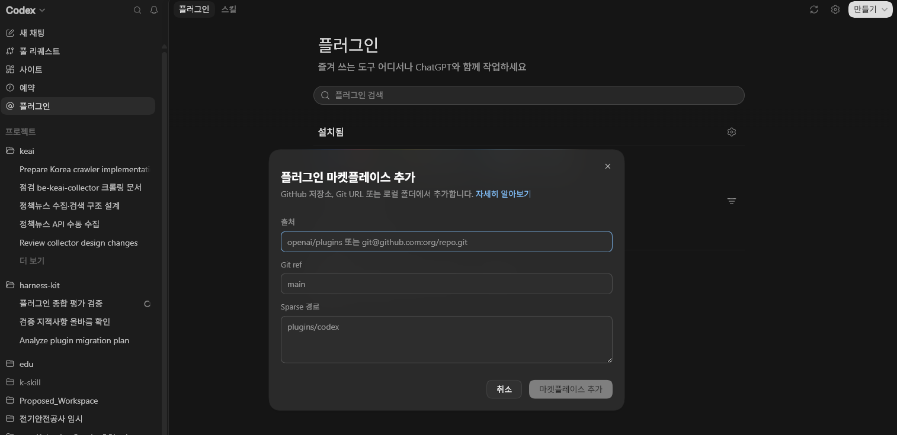
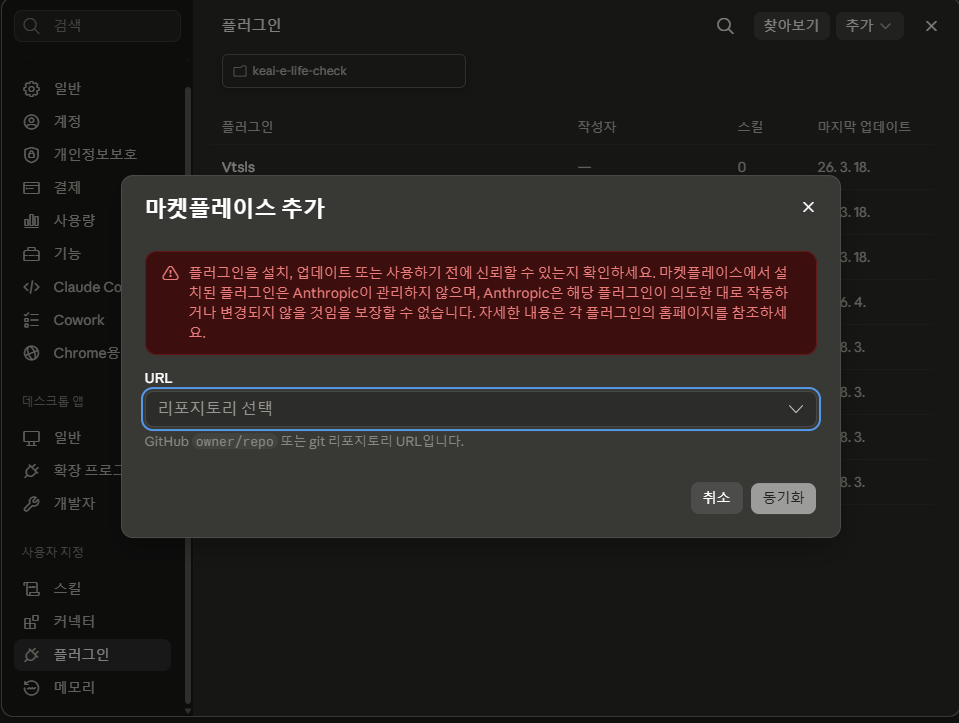

# Plugin Installation Guide

> 기준일: 2026-08-03
> 대상 플러그인: `harness-kit` `0.3.1`
> 현재 상태: 공식 manifest·marketplace와 격리 CLI 설치 smoke를 자동 검증한다.
> Codex와 Claude의 CLI·앱 네 인터페이스에서 실제 모델 호출·산출물·새 세션 증적까지
> 확보되기 전에는 `not release-ready`다.

이 문서는 실제 프로젝트 사용자가 하네스 저장소를 clone하거나 스킬을 복사하지 않고 플러그인으로 시작하기 위한 설치·확인·업데이트·제거 기준이다.

---

## 1. 먼저 알아야 할 것

- 이 저장소는 관리자용 원본 저장소다.
- 실제 프로젝트에는 `plugins/harness-kit` 또는 배포된 marketplace source를 통해 플러그인을 설치한다.
- 설치 후 새 task/session 또는 reload가 필요하다.
- 프로젝트에서는 `harness-setup`을 호출해 `.docs/**`, 루트 `AGENTS.md`, `CLAUDE.md`만 만든다.
- `harness-setup`은 사용자 프로젝트에 `.agents/skills/`, `.claude/skills/`, `skills/`를 생성하거나 스킬을 복사·동기화하지 않는다.
- `.md` 산출물 후처리는 별도 `im-not-ai` 설치 없이 내장 `humanize-korean`을 쓴다.

---

## 2. 현재 릴리스 후보 정보

| 항목 | 값 |
|------|----|
| Plugin ID | `harness-kit` |
| Version | `0.3.1` |
| Local plugin root | `plugins/harness-kit` |
| Archive | `plugins/harness-kit-0.3.1.zip` |
| Archive SHA-256 | `maintainer/plugin/release.json`의 현재 생성값 |
| Codex physical skills | 19 |
| Codex agents | 0 |
| Claude physical skills | 19 |
| Claude agents | 0 |
| Release gate | `not-release-ready` |

릴리스 게이트 증적은 [maintainer/plugin/release-checklist.md](../maintainer/plugin/release-checklist.md)와 [maintainer/plugin/install-verification.json](../maintainer/plugin/install-verification.json)에 있다.

---

## 3. Codex CLI

> CLI 설치 smoke는 `0.3.1` 기준으로 Codex CLI와 Claude Code 양쪽에서 통과했다.
> 격리된 설정 디렉터리에서 설치 payload와 cache를 확인했으며, 실제 모델 호출은
> 별도 수동 증적으로 남긴다.

공식 Codex CLI `0.146.0`을 임시 `CODEX_HOME`에서 실행해 아래 marketplace
등록·설치·목록·제거 흐름과 설치 cache의 skills / 0 agents를 확인했다. CI도
같은 격리 smoke를 반복하고, 배포 전 실제 사용자 CLI에서 한 번 더 확인한다.

### 3-1. marketplace source 관리

Git-backed marketplace를 사용하는 경우:

```text
codex plugin marketplace add <github-owner/repo | git-url | 저장소-루트-경로>
codex plugin marketplace list
```

`marketplace add`에는 source 하나만 전달한다. Git ref를 고정하려면 `--ref`를
사용한다. 저장소 루트의 `.agents/plugins/marketplace.json`이
`hb9397` marketplace에서 `harness-kit` 플러그인을 노출한다.

업데이트는 marketplace를 갱신한 뒤 plugin을 재설치하는 방식으로 검증한다.

```text
codex plugin marketplace upgrade hb9397
codex plugin remove ai-agent-harness@ai-agent-harness   # 이전 설치가 남아 있을 때만
codex plugin add harness-kit@hb9397
```

### 3-2. 비대화식 설치 관리

```text
codex plugin add harness-kit@hb9397
codex plugin list
codex plugin remove harness-kit@hb9397
```

설치 후 새 task를 열고 Codex 명시 호출인 `$harness-setup`,
`$humanize-korean`이 동작하는지 확인한다. 자연어 요청은 별도 대조 항목으로
기록하며 명시 호출 성공을 대신하지 않는다.

### 3-3. Codex 앱의 대화형 설치

Codex 앱에서는 왼쪽 메뉴의 **플러그인**과 `/plugins` UI에서 설치·활성화·
비활성화를 확인한다. CLI 설치와 앱 설치는 cache·활성 session이 다를 수 있으므로
둘을 별도 증적으로 남긴다.

### 3-4. Codex IDE extension

Phase 8 기준 Codex IDE extension은 별도 공식 플러그인 설치 인터페이스로 보지
않는다. 프로젝트에서 확장이 Codex CLI/앱 플러그인 상태를 공유하지 않으면
`AGENTS.md`와 `.docs` 산출물만 일반 프로젝트 문서로 참조한다.

---

## 4. Codex 앱

아래 화면은 Codex 앱에서 **플러그인 → 설정 → 플러그인 마켓플레이스 추가**를
연 예시다. 화면 이름은 앱 버전에 따라 달라질 수 있지만 저장소 source, Git ref,
선택적 sparse 경로를 입력한다는 흐름은 같다.



Codex 앱에서는 다음을 수동으로 확인한다.

1. 왼쪽 메뉴에서 **플러그인**을 열고 설치 목록의 설정 아이콘을 누른다.
2. **플러그인 마켓플레이스 추가**에서 `hb9397/harness-kit` 저장소 또는 Git URL,
   `main` ref를 입력한다. monorepo 일부만 사용할 때만 sparse 경로를 지정한다.
3. 추가한 marketplace에서 `harness-kit`을 찾아 설치한다.
4. local marketplace가 앱에 보이지 않는 버전이면 앱과 같은 사용자 프로필의
   Codex CLI에서 marketplace와 플러그인을 등록하고 앱을 완전히 종료했다가 다시
   연다.
5. 플러그인 화면 또는 `/plugins`에서 `harness-kit` `0.3.1`이
   설치·활성 상태인지 확인한다.
6. 새 fixture 프로젝트에서 새 task/session을 연다.
7. `$harness-setup`과 `$humanize-korean`을 명시 호출한다.
8. 새 버전 후보를 설치하거나 stale cache를 비운 뒤 version marker가 갱신되는지 확인한다.

앱 버전에 local marketplace를 직접 추가하는 UI가 없다면 위 CLI fallback을
사용하고, UI 직접 설치인지 CLI 설치 후 앱 사용인지 수동 증적에 구분해 기록한다.

자동 검증은 package와 CLI까지만 수행하며 Codex 앱 결과는 `manual-required`다.
Codex 앱에서는 `$skill-name`, ChatGPT Work에서는 `@` mention을 사용하므로 이
릴리스의 Codex 앱 증적은 `$harness-setup`으로 남긴다. ChatGPT Work를 추가
지원 범위로 검증하면 `@` 호출 결과를 별도 인터페이스 증적으로 기록한다.

---

## 5. Claude Code CLI

공식 Claude Code `2.1.220`을 별도 `CLAUDE_CONFIG_DIR`과 plugin cache에서 실행해
아래 흐름과 설치 cache의 skills / 0 agents를 확인했다. CI도 같은 격리 smoke를
반복한다.

```text
claude plugin validate plugins/harness-kit --strict
claude plugin validate . --strict
claude plugin marketplace add <github-owner/repo | git-url | 저장소-루트-경로>
claude plugin marketplace list
claude plugin install harness-kit@hb9397
claude plugin list
```

설치 후 `claude` 대화형 session 안에서 `/reload-plugins`를 실행한다.

업데이트와 제거:

```text
claude plugin marketplace update hb9397
claude plugin update harness-kit@hb9397
claude plugin uninstall harness-kit@hb9397
```

검증:

- namespaced `/harness-kit:harness-setup` 호출 가능
- namespaced `/harness-kit:humanize-korean` 호출 가능
- `.claude-plugin/plugin.json`의 version 확인
- `/reload-plugins` 후 새 skill 목록 확인

---

## 6. Claude 앱

아래 화면은 Claude 앱의 **설정 → 플러그인 → 추가 → 마켓플레이스 추가** 예시다.
GitHub `owner/repo` 또는 Git 저장소 URL을 선택하고 동기화한다.



Claude 앱과 Claude Code CLI는 일부 설정을 공유할 수 있지만 host별 plugin cache와
활성 session을 따로 확인해야 한다.

1. **설정 → 플러그인**에서 **추가 → 마켓플레이스 추가**를 연다.
2. `hb9397/harness-kit` 또는 Git 저장소 URL을 선택하고 **동기화**한다.
3. 동기화된 marketplace에서 `harness-kit`을 설치한다.
4. local marketplace가 목록에 보이지 않으면 같은 사용자 설정의 Claude Code
   CLI에서 marketplace만 등록한 뒤 앱을 다시 열어 설치한다.
5. SSH host를 공식 지원 범위로 선언하는 릴리스라면 해당 remote host에서도
   plugin cache와 설치를 별도로 확인한다.
6. 앱 재시작
7. 새 Code session
8. `/harness-kit:harness-setup`,
   `/harness-kit:humanize-korean` 명시 호출 확인
9. cloud Code session은 plugin browser가 없어 프로젝트 `enabledPlugins` 정책을 별도 적용
10. WSL session은 Desktop plugin 설치 인터페이스로 지원하지 않음을 명시

Phase 7 자동 검증 결과: `manual-required`.

---

## 7. Claude Chat/Cowork

Claude Chat/Cowork는 Claude Code 플러그인과 같은 설치 인터페이스로 취급하지 않는다.

- Code 탭에서 검증된 플러그인이 Chat/Cowork에서 자동 활성화된다고 가정하지 않는다.
- Chat/Cowork에서 같은 스킬을 쓰려면 별도 프로젝트/워크스페이스 지침, 권한, 파일 접근 범위를 문서화한다.
- 사용자가 Code와 Chat을 오가면 최종 기준 문서는 프로젝트의 `AGENTS.md`와 `.docs`로 둔다.

---

## 8. private GitHub와 cache

Private GitHub source를 사용할 때 확인할 것:

- CLI/App이 GitHub 인증 정보를 읽을 수 있는지
- 조직 SSO나 PAT 권한이 marketplace/source clone에 충분한지
- stale cache가 남아 이전 버전을 로드하지 않는지
- 새 session에서 version marker가 바뀌는지
- 실패 시 원본 프로젝트 파일을 건드리지 않고 plugin cache만 재설치하는지

보수 재설치 절차:

```text
codex plugin list 또는 claude plugin list
플랫폼별 plugin remove/uninstall ai-agent-harness@ai-agent-harness  # 구 버전 migration 시 1회
플랫폼별 plugin marketplace upgrade/update hb9397
플랫폼별 plugin add/install harness-kit@hb9397
새 task/session
version marker 확인
```

---

## 9. 설치 후 첫 하네스 설정

플러그인을 설치한 뒤 프로젝트에서 다음 순서로 진행한다.

```text
harness-setup 명시 호출
→ 단일/복수 앱 확인
→ .docs 생성 또는 갱신
→ AGENTS.md 생성 또는 갱신
→ CLAUDE.md bridge 생성 또는 갱신
→ .agents/skills·.claude/skills·skills 미생성 확인
→ design-doc/context-doc/harness-bootstrap로 프로젝트 문서화
```

복수 앱에서는 `.docs/root-context/AGENTS.md`가 루트 컨텍스트의 관리 원본이다. 루트 `CLAUDE.md`는 `AGENTS.md`를 읽도록 하는 bridge로 둔다.

플랫폼별 명시 호출:

| 플랫폼 | 호출 예 |
|---|---|
| Codex CLI·앱 | `$harness-setup` |
| Claude Code CLI·Claude 앱 | `/harness-kit:harness-setup` |

---

## 10. Markdown 산출물 후처리

다음 스킬은 `.md` 산출물을 만들 수 있다.

- `harness-setup`
- `harness-bootstrap`
- `context-doc`
- `design-doc`
- `design-prototype-docs`
- `impl-doc`
- `impl-fe-be-doc`

산출물 생성 후 흐름:

```text
원 producer 검증
→ 최외곽 producer가 artifact_bundle_id와 handoff_owner 확정
→ 중첩 producer는 suppress_child_handoff=true로 별도 제안 억제
→ bundle을 humanize-korean document-refinement profile에 한 번만 전달
→ 개선안과 diff 확인
→ 보호 token·링크·표·코드블록 보존 확인
→ 사용자 승인
→ 승인된 파일만 반영
→ 원 producer의 구조·index·bridge 재검증
```

`humanize-korean`은 기본적으로 proposal-only다. 사용자가 승인하지 않으면 원본 파일을 변경하지 않는다.

---

## 11. 기존 local skill copy 마이그레이션

기존 프로젝트에 `.agents/skills` 또는 `.claude/skills`가 남아 있을 수 있다. 이 경우 기본 동작은 삭제가 아니라 읽기 전용 inventory다.

분류:

- known old harness copy
- user-modified old copy
- unknown custom skill

삭제 또는 이동은 다음 조건을 만족해야 한다.

1. 백업 대상 확인: `.docs/archive/legacy-agent-skills/{timestamp}/`
2. 사용자 승인
3. backup/remove 실행
4. 플러그인 단일 discovery 확인
5. 문제 발생 시 백업 복원

산출물, 스크립트, 템플릿을 가진 스킬은 자동 제거하지 않는다.

---

## 12. 문제 해결

| 증상 | 조치 |
|------|------|
| 스킬이 보이지 않음 | 새 task/session, `/reload-plugins`, 앱 재시작을 먼저 수행 |
| 구버전이 보임 | plugin version marker와 cache를 확인하고 remove/add |
| Codex CLI가 실행되지 않음 | CLI 자체 권한/설치 문제를 먼저 해결하고, 필요하면 공식 npm 패키지를 임시 `CODEX_HOME`에서 검증 |
| Claude CLI가 없음 | 공식 Claude Code CLI를 설치하거나 격리된 npm package 실행으로 명령 surface 재검증 |
| `humanize-korean`이 원본을 바꾸려 함 | 중단. proposal-only 계약 위반으로 보고 |
| local copy와 plugin skill이 중복됨 | inventory 후 승인형 backup/remove 절차 수행 |
| setup 후 새 skill 디렉터리가 생김 | 중단. `.docs/**`, `AGENTS.md`, `CLAUDE.md` 출력 allowlist 위반으로 보고 |

---

## 13. CLI·앱 직접 테스트 예시와 증적

자동 CLI smoke는 설치 cache와 payload 수를 검증하지만 실제 agent가
`harness-setup`을 수행한 결과까지 대신하지 않는다. 릴리스 판단 전에는 각 인터페이스의
서로 다른 새 fixture 프로젝트에서 다음을 직접 확인한다.

1. 실제 플러그인 설치·활성 버전
2. 새 task/session에서 명시 호출
3. `.docs/**`, `AGENTS.md`, `CLAUDE.md` 생성
4. `.agents/skills`, `.claude/skills`, `skills` 미생성
5. 재실행 시 managed block 밖 사용자 확장 보존
6. 새 task/session에서 같은 artifact fingerprint의 문서 개선안 재제안 없음
7. 실패·중단 시 기존 파일 보존

정확한 Codex CLI·앱, Claude Code CLI·Claude 앱 명령 예와 인터페이스별 증적 양식은
[Direct Plugin Surface Test Record](../maintainer/plugin/manual-surface-test-template.md)를
복사해 사용한다. 스크린샷만 남기지 말고 CLI/app 버전, plugin version, fixture
경로, 명시 호출, 생성 파일, 금지 경로 검사 출력과 검토자를 함께 기록한다.
중복 handoff 검증은 `.docs/.harness/humanize-handoffs.json`의 event와 함께
남기며 이 JSON 자체는 Markdown 개선 대상에서 제외한다.
