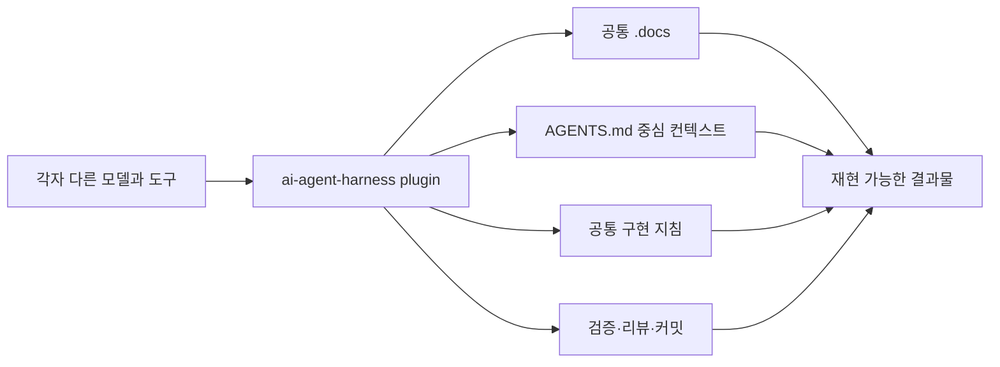

# 왜 플러그인 기반 공통 하네스로 시작하는가

> AI Agent Harness Engineering 소개 문서
> 현행 운영 정본: [Harness_Engineering.md](./Harness_Engineering.md)

---

## 이 문서의 핵심

AI를 팀에서 쓰면 모델과 도구가 갈린다. 어떤 사람은 Codex를 쓰고, 어떤 사람은 Claude Code를 쓴다. 문제는 도구가 다른 것이 아니라, 각자가 다른 규칙과 다른 문서 구조로 일하면서 결과가 흔들리는 것이다.

이 하네스는 그 문제를 줄이기 위해 만든 공통 작업 체계다. 이제 실제 프로젝트에서는 이 저장소를 clone하거나 스킬을 복사하지 않고, **`ai-agent-harness` 플러그인을 설치해서 시작한다.**

---

## 왜 clone/copy에서 플러그인으로 바꾸는가

기존 방식은 프로젝트 옆에 하네스 저장소를 두고 `.agents/skills`, `.claude/skills`를 복사하는 구조였다. 이 방식은 초기에 빠르지만 시간이 지나면 문제가 생긴다.

- 사용자 프로젝트마다 스킬 버전이 달라진다.
- `.agents`와 `.claude` 복사본이 서로 어긋난다.
- 관리자용 스킬과 사용자용 스킬 경계가 흐려진다.
- 외부 스킬을 참고한 것인지 직접 가져온 것인지 추적하기 어렵다.
- 업데이트가 “어느 파일을 복사해야 하는가” 문제로 변한다.

플러그인 방식에서는 사용자는 플러그인 설치와 `harness-setup`만 수행한다. 스킬 패키징, 플랫폼별 projection, 외부 upstream 최신화는 관리자가 이 저장소에서 처리한다.

---

## 사용자와 관리자의 역할

| 역할 | 하는 일 | 하지 않는 일 |
|------|---------|--------------|
| 프로젝트 수행자 | 플러그인 설치, `harness-setup`, `.docs`와 루트 컨텍스트 생성, 설계·구현·검증 스킬 사용 | 하네스 저장소 clone, 스킬 복사, `.agents/.claude` 동기화 |
| 하네스 관리자 | 사용자 스킬 정본 관리, 외부 upstream 검토, 플러그인 build/validate/release gate 관리 | 사용자 프로젝트의 `.docs` 산출물을 직접 관리 |

이 분리가 핵심이다. 사용자는 프로젝트 결과물에 집중하고, 관리자는 하네스 품질과 배포를 책임진다.

---

## 무엇을 고정하는가

하네스가 고정하는 것은 프롬프트 한두 줄이 아니다.

1. 설계 문서의 형태
2. 에이전트가 읽을 `AGENTS.md` 중심 컨텍스트
3. `CLAUDE.md` bridge
4. `.docs` 구조
5. 구현 지침서의 형태
6. 리뷰·검증·커밋 흐름
7. Markdown 산출물 개선안 검토 흐름
8. 외부 스킬 참고/반입 provenance

---

## 실제 프로젝트 사용 예시

```text
1. Codex 또는 Claude에 ai-agent-harness 플러그인을 설치한다.
2. 새 task/session을 연다.
3. harness-setup을 실행한다.
4. 단일 앱인지 복수 앱인지 확인한다.
5. .docs, AGENTS.md, CLAUDE.md를 생성한다.
6. design-doc 또는 harness-bootstrap으로 설계 문서를 만든다.
7. context-doc으로 에이전트 컨텍스트를 정리한다.
8. impl-doc 또는 impl-fe-be-doc으로 구현 계획을 만든다.
9. humanize-korean 개선안을 검토하고 승인 여부를 정한다.
10. 승인된 최종 Markdown을 기준으로 구현·검증을 진행한다.
```

RFP가 있으면 더 이상 `rfp-ingest`를 쓰지 않는다. RFP 파일이나 핵심 요구사항을 설계·프로토타입·구현 계획 스킬에 직접 제공한다.

---

## `AGENTS.md` 정본과 `CLAUDE.md` bridge

현행 기준에서 프로젝트 컨텍스트의 정본은 `AGENTS.md`다. Claude 환경에서는 `CLAUDE.md`가 `AGENTS.md`를 읽도록 하는 bridge 역할을 한다.

복수 앱에서는 `.docs/root-context/AGENTS.md`를 관리 원본으로 두고, 루트의 `AGENTS.md`와 `CLAUDE.md`는 실행용으로 생성·갱신한다.

---

## 문서 개선 흐름이 추가된 이유

AI가 만든 Markdown은 구조는 맞아도 문장이 기계적이거나 팀 문서 톤과 어긋날 수 있다. 그래서 `.md` 산출물을 만드는 스킬 뒤에는 내장 `humanize-korean`으로 개선안을 볼 수 있게 했다.

중요한 점:

- `humanize-korean`은 원본을 바로 덮어쓰지 않는다.
- diff와 변경 이유를 먼저 보여준다.
- 링크, 코드블록, 경로, 식별자, 표 구조 같은 보호 요소를 보존한다.
- 사용자가 승인한 변경만 반영한다.
- 반영 후 원 producer가 구조와 링크를 다시 검증한다.

문서 개선을 건너뛰어도 하네스 흐름은 계속 가능하다.

---

## 팀 관점의 효과



기대 효과:

- 모델이 달라도 작업 흐름이 유지된다.
- 신규 인원이 프로젝트 문맥을 빠르게 따라온다.
- 구현 전 설계와 구현 후 검증이 남는다.
- 외부 스킬 반영 이력이 추적된다.
- 문서와 코드가 함께 움직인다.

---

## 마지막으로

이 하네스의 목적은 AI를 “더 많이” 쓰는 것이 아니다. 목적은 누가 어떤 모델을 쓰더라도 팀의 기준 위에서 비슷한 품질의 결과를 반복해서 내는 것이다.

실제 프로젝트에서는 [Plugin Installation Guide](./Plugin_Installation_Guide.md)에서 시작하고, 세부 운영 기준은 [Harness_Engineering.md](./Harness_Engineering.md)를 따른다.
