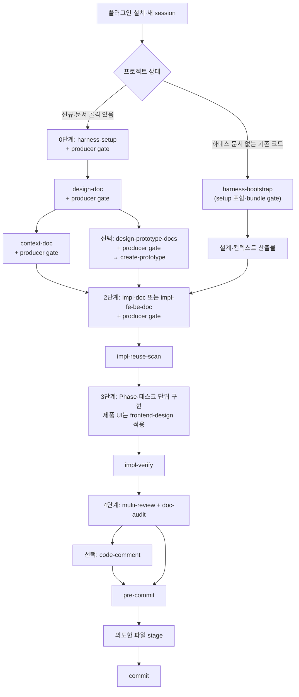

# AI Agent Harness — 관리 저장소

> 이 저장소는 하네스를 개발·검증·배포하는 **관리 저장소**다.
> 실제 프로젝트에서는 이 저장소를 clone하거나 스킬을 복사하지 않고,
> Codex 또는 Claude에 사용자용 `ai-agent-harness` 플러그인을 설치해서 사용한다.

플러그인을 설치한 프로젝트 수행자는 `harness-setup`으로 `.docs/**`,
`AGENTS.md`, `CLAUDE.md`를 만든 뒤 설계·구현·검증 흐름을 수행한다. 관리자는
이 저장소에서 사용자 스킬, 외부 upstream, 플러그인 패키지를 유지한다.

현재 릴리스 후보:

- Plugin ID: `ai-agent-harness`
- Version: `0.1.0`
- Archive: `plugins/ai-agent-harness-0.1.0.zip`
- 사용자 스킬: 18종
- Codex runtime: 18 skills / 0 agents
- Claude runtime: 18 skills / 0 agents
- 관리자 스킬: 3종, 이 저장소 안에서만 사용
- 릴리스 상태: `not release-ready` — 공식 CLI 설치 smoke와 별도로 Codex·Claude
  CLI·앱 네 표면의 실제 모델 호출 수동 증적이 모두 필요함

설치 명령과 앱별 확인 절차는
[Plugin Installation Guide](./Docs/Plugin_Installation_Guide.md)를 먼저 본다.
하네스의 상세 운영 계약은
[Harness Engineering](./Docs/Harness_Engineering.md)이 정본이다.

---

# 제1부. 사용자용 — 실제 프로젝트 수행

## 1. 플러그인 적용

### Codex

- CLI: `codex plugin marketplace add <이 저장소 URL 또는 루트 경로>` 후
  `codex plugin add ai-agent-harness@ai-agent-harness`
- Codex Desktop/App: Codex의 Plugins 화면에서 marketplace와 플러그인을
  추가한다. 앱 UI가 local marketplace 등록을 지원하지 않으면 같은 사용자
  프로필의 CLI에서 등록한 뒤 앱을 재시작한다.
- 설치 후 새 task에서 `$harness-setup`처럼 `$skill-name`으로 명시 호출한다.
  ChatGPT Work의 `@` 호출과 혼동하지 않는다.
- IDE extension은 별도의 플러그인 설치 표면으로 보지 않는다. Codex CLI/App
  설치를 우선한다.

### Claude

- Claude Code CLI:
  `claude plugin marketplace add <이 저장소 URL 또는 루트 경로>` 후
  `claude plugin install ai-agent-harness@ai-agent-harness`
- 설치 후 대화형 session에서 `/reload-plugins`를 실행하고
  `/ai-agent-harness:harness-setup`처럼 namespaced skill을 명시 호출한다.
- Claude Desktop Code 탭은 Plugins UI에서 설치한다. local marketplace가
  보이지 않으면 같은 사용자 프로필의 CLI에서 marketplace를 등록한 뒤 앱에서
  설치하고 새 session을 연다.
- Claude Chat/Cowork는 Code 플러그인과 별도 표면이다. 설치·권한·cache는
  별도로 검증한다.

현재 자동 증적은 Codex CLI `0.146.0`과 Claude Code `2.1.220`에서 marketplace
등록, plugin 설치, 18 skills / 0 agents 확인, 제거까지 통과한 것이다. 이는
설치·cache smoke이며 실제 모델이 스킬을 올바르게 수행했다는 증적은 아니다.

## 2. 기본 작업 흐름 한눈에 보기

새 프로젝트, RFP 프로젝트, 문서 없는 기존 코드베이스는 진입점만 다르고 같은
구현·검증 흐름으로 합류한다.



여기서 `producer gate`는 **원 producer 구조 검증 → 최외곽 owner의
`humanize-korean` 제안 → 사용자 결정 → 승인 변경 반영 → 원 producer
재검증**을 뜻한다. 이 gate를 통과한 최종 Markdown만 다음 노드로 넘긴다.

### 0단계 — 환경 준비

1. Codex 또는 Claude에 플러그인을 설치하고 새 task/session을 연다.
2. 여러 앱 repo의 Git 작성자 계정을 한 번에 맞춰야 할 때만
   `git-scoped-account`를 명시 호출한다.
3. 신규 프로젝트나 기존 문서 골격의 갱신·복구에는 `harness-setup`을 실행한다.
   하네스 문서가 없는 기존 코드라면 `harness-bootstrap`으로 바로 진입하며,
   이 workflow가 내부에서 `harness-setup`을 수행한다.
4. 생성·갱신 범위가 `.docs/**`, 루트 `AGENTS.md`, `CLAUDE.md`뿐인지 확인한다.
5. `harness-setup`이 플러그인의 사용자 스킬 복사본을
   `.agents/skills/`, `.claude/skills/`, `skills/`에 만들지 않았는지 확인한다.

`harness-setup`은 플러그인을 설치하는 스킬이 아니다. 설치된 플러그인을 사용해
프로젝트 문서 골격과 루트 컨텍스트를 만드는 스킬이다. 기존 local skill copy가
있으면 읽기 전용으로 분류·보고하며 승인 없이 수정하거나 삭제하지 않는다.

### 1단계 — 설계·컨텍스트·프로토타입

- 아이디어나 요구사항이 있으면 `design-doc`으로 설계한다.
- RFP가 있으면 파일이나 필요한 요구사항을 `design-doc`,
  `design-prototype-docs`, 다중 화면·FE/BE 페어 계획용 `impl-fe-be-doc`
  요청에 직접 제공한다. 단일·소규모 `impl-doc`은 승인된 설계나 PRD를
  입력으로 삼는다. `rfp-ingest`는 없다.
- 문서 없는 기존 코드베이스에는 `harness-bootstrap`을 사용한다. 이 스킬은
  필요한 `harness-setup` 골격을 확인한 뒤 코드에서 설계와 컨텍스트를
  역추출한다.
- 설계가 정리되면 `context-doc`으로 `AGENTS.md` 정본, `CLAUDE.md` bridge,
  주제별 instruction 문서를 만든다.
- 화면을 먼저 합의해야 하면 `design-prototype-docs`로 화면 설계 문서를 만들고
  `create-prototype`으로 폐기 가능한 검증 시안을 만든다.

`design-doc`은 초안을 대화창에 보여 주고, 사용자가 저장을 승인할 때 파일로
저장한다. 후속 스킬에 파일 경로를 넘길 계획이라면 저장까지 요청한다.

### 2단계 — 구현 계획과 재사용 점검

| 상황 | 선택 |
|------|------|
| 한 앱의 단일 BE 기능, 단일 FE 기능, 모듈, CLI, 배치, 스크립트, 라이브러리 | `impl-doc` |
| FE/BE 페어 다중 기능, 다중 화면, RFP/SFR 화면 중심 작업 | `impl-fe-be-doc` |

구현 계획을 만든 다음 각 Phase 또는 태스크 시작 직전에
`impl-reuse-scan`으로 기존 공통 모듈·컴포넌트·패턴을 찾는다. 이 스킬은 후보를
보고할 뿐 자동으로 코드를 바꾸지 않는다.

### 3단계 — 구현과 검증

1. 구현 계획에서 이번 턴의 Phase 또는 태스크 하나를 고른다.
2. 참조 문서, 수정 허용 파일, 금지 범위, 완료 기준을 함께 제시한다.
3. UI 비중이 높은 실제 제품 코드는 `frontend-design` 기준을 적용한다.
4. 구현이 끝나면 `impl-verify`로 계획 대비 PASS/FAIL/SKIP 매트릭스를 만든다.
5. 실패가 있으면 해당 Phase를 보완하고 다시 검증한다.

`create-prototype`은 `.docs/prototype/` 아래 검증 시안을 만드는 스킬이고,
`frontend-design`은 실제 제품 UI를 구현하는 스킬이다.

### 4단계 — 품질·문서·커밋

1. `multi-review`로 보안·성능·유지보수·테스트 관점을 점검한다.
2. `doc-audit`으로 코드와 `.docs`, `AGENTS.md`의 괴리를 찾는다.
3. 필요한 문서 변경은 제안을 검토하고 승인한 뒤 반영한다.
4. 인수인계에 필요한 주석이 부족할 때만 `code-comment`를 사용한다.
5. 파일이 바뀐 최종 상태에서 `pre-commit`으로 커밋 전 규칙을 검사한다.
6. 의도한 파일만 stage한다.
7. 검증을 통과하면 `commit`으로 Conventional Commits 형식의 커밋을 만든다.

`pre-commit` 뒤에 주석이나 코드를 다시 고쳤다면 검사를 재실행한다.

플랫폼별 사용자 스킬을 맞추는 `agent-sync` 단계는 없다. 스킬 버전은 설치된
플러그인이 제공하고, 프로젝트는 결과 문서와 코드만 관리한다.

## 3. Markdown 산출물과 문서 개선

다음 7개 producer가 Markdown bundle을 만들면 원 producer가 먼저 구조를
검증하고, bundle의 최외곽 owner가 `humanize-korean` 개선안과 diff를 한 번만
제안한다.

- `harness-setup`
- `harness-bootstrap`
- `design-doc`
- `context-doc`
- `design-prototype-docs`
- `impl-doc`
- `impl-fe-be-doc`

사용자가 승인한 변경만 반영하며, 링크·경로·코드블록·표·식별자 같은 보호 요소를
보존한다. 반영 뒤에는 원 producer가 링크·index·bridge·문서 구조를 다시
검증한다. 제안·건너뛰기·거절·적용 상태와 내용 fingerprint는
`.docs/.harness/humanize-handoffs.json`에 기록해 같은 내용의 중복 제안을
막는다. 문서 개선을 건너뛰어도 원래 하네스 흐름은 계속된다.

## 4. 최초 실행과 갱신 시점

| 항목 | 최초 | 다시 실행할 때 |
|------|------|----------------|
| 플러그인 설치 | 사용자 프로필에 설치 | 새 릴리스 적용 시 plugin update 후 새 session |
| `git-scoped-account` | 여러 repo의 작성자 계정 설정이 필요할 때 | 계정·remote 범위가 바뀔 때 |
| `harness-setup` | 프로젝트 문서 골격 생성 | 앱 구성, 루트 컨텍스트, `.docs` 골격 복구가 필요할 때 |
| `design-doc` | 아이디어·요구사항을 설계로 고정 | 핵심 요구사항이나 아키텍처 결정이 바뀔 때 |
| `harness-bootstrap` | 문서 없는 기존 코드에 최초 도입 | 전체 재스캔보다 `design-doc`·`context-doc` 갱신을 우선 |
| `context-doc` | 설계를 에이전트 규칙으로 변환 | 설계·프레임워크·실행 방법·금지 규칙이 바뀔 때 |
| `impl-*` | 기능 구현 전에 작성 | 범위·Phase·의존성·완료 기준이 바뀔 때 |
| `doc-audit` | 필요 시 | 코드와 문서가 어긋났거나 릴리스 전일 때 |

플러그인 업데이트는 사용자 스킬을 갱신하지만 프로젝트 `.docs`를 자동으로
갈아엎지 않는다. 프로젝트 문서 갱신은 해당 producer의 승인 흐름으로 수행한다.

## 5. 단일/복수 앱과 `.docs`

### 단일 애플리케이션

앱 repo 안에서 코드와 하네스 산출물을 함께 관리한다.

```text
my-app/
├── .docs/
│   ├── context-base/
│   ├── instruction/
│   ├── impl-doc/
│   ├── prototype/
│   └── .harness/
├── AGENTS.md            ← 공용 컨텍스트 정본
├── CLAUDE.md            ← AGENTS.md bridge
└── src/
```

### 복수 애플리케이션

프로젝트 최상위 폴더는 보통 git으로 관리하지 않고 앱 repo와 공용 `.docs` repo를
분리한다.

```text
my-project/
├── app-frontend/        ← 별도 git repo
├── app-backend/         ← 별도 git repo
├── .docs/               ← 별도 git repo 권장
│   ├── app-frontend/
│   ├── app-backend/
│   └── root-context/
├── AGENTS.md            ← 실행용
└── CLAUDE.md            ← AGENTS.md bridge
```

복수 앱에서 `.docs/root-context/AGENTS.md`는 루트 정본 내용의 형상관리
복사본이자 갱신 기준인 관리 원본이다. 루트 `AGENTS.md`와 `CLAUDE.md`는
실행용 파일이며 `harness-setup`이 관리 원본을 기준으로 갱신한다. 이미 별도
`.docs` repo를 운영하고 있다면 먼저 올바른 위치에 clone/pull한 뒤
`harness-setup`을 실행해 기존 문서를 기준으로 갱신한다.

## 6. 주요 산출물과 형상관리

| 산출물 | 기본 위치 | 관리 기준 |
|--------|-----------|-----------|
| 설계 문서 | 단일 `.docs/context-base/DESIGN.md`, 복수 `.docs/{앱}/context-base/DESIGN.md` | 프로젝트 문서로 commit |
| 에이전트 규칙 | `AGENTS.md`, `CLAUDE.md`, `.docs/**/instruction/` | `AGENTS.md` 정본, `CLAUDE.md` bridge |
| 화면 설계 | `.docs/prototype/{사용자}/{식별자}/design-doc.md` | 프로젝트 문서로 commit |
| 프로토타입 | `.docs/prototype/{사용자}/{식별자}/` | 검증용 산출물, 프로젝트 정책에 따라 commit |
| 구현 계획 | 단일 `.docs/impl-doc/{사용자}/`, 복수 `.docs/{앱}/impl-doc/{사용자}/` | 계획서와 공용 roadmap index를 함께 관리 |
| 문서 개선 ledger | `.docs/.harness/humanize-handoffs.json` | 최종 Markdown fingerprint와 결정 상태 관리 |
| 사용자 스킬 | 설치된 `ai-agent-harness` 플러그인 | 프로젝트에 복사하지 않음 |

`impl-doc`과 `impl-fe-be-doc`은 같은 저장소와
`{YYMMDD}-0.{앱이름}-roadmap-impl-index.md`를 공유한다. 생성 스킬은 문서
머리말로 구분한다.

## 7. 사용자 스킬 18종

| 계열 | 스킬 | 주 용도 |
|------|------|---------|
| 설치·기반 | `harness-setup` | `.docs`와 루트 컨텍스트 초기화·복구 |
| 설치·기반 | `harness-bootstrap` | 기존 코드에서 설계·컨텍스트 역추출 |
| 설치·기반 | `git-scoped-account` | 프로젝트 트리 하위 repo Git 계정 설정 |
| 설계·컨텍스트 | `design-doc` | 요구사항·아이디어·RFP를 구조화한 설계 |
| 설계·컨텍스트 | `context-doc` | `AGENTS.md` 정본, Claude bridge, instruction 생성 |
| 프로토타입 | `design-prototype-docs` | 화면 설계 문서 생성 |
| 프로토타입 | `create-prototype` | HTML/CSS/JS 기반 검증 시안 생성 |
| UI | `frontend-design` | 실제 제품 UI 구현 품질 기준 |
| 구현 계획 | `impl-doc` | 단일·소규모 기능 구현 계획 |
| 구현 계획 | `impl-fe-be-doc` | FE/BE 페어·다중 화면 구현 계획 |
| 구현 점검 | `impl-reuse-scan` | 구현 전 재사용 후보 보고 |
| 구현 검증 | `impl-verify` | Phase·태스크 검증 매트릭스 |
| 품질 | `multi-review` | 보안·성능·유지보수·테스트 리뷰 |
| 품질 | `pre-commit` | 커밋 전 규칙 검사 |
| 품질 | `commit` | Conventional Commits 커밋 |
| 품질 | `code-comment` | 필요한 변경 코드의 한글 주석 보강 |
| 문서 | `doc-audit` | 코드와 문서의 괴리 분석 |
| 문서 | `humanize-korean` | Markdown 개선안·diff 제안 |

`rfp-ingest`와 `agent-sync`는 제거됐다. `custom-skill-design`은 사용자 스킬이
아니라 이 관리 저장소에서만 쓰는 관리자 스킬이다.

## 8. 기존 프로젝트의 local skill copy 전환

기존 `.agents/skills`, `.claude/skills` 또는 `skills/*/SKILL.md` 복사본은
바로 삭제하지 않는다.

1. 사용자 플러그인을 설치한다.
2. 기존 local copy를 읽기 전용으로 inventory한다.
3. 구버전 복사본, 사용자 수정 복사본, 프로젝트 custom skill을 분류한다.
4. 백업 위치와 복원 방법을 확인한다.
5. 사용자가 승인한 항목만 backup/remove 한다.
6. 새 session에서 플러그인 스킬만 한 번 노출되는지 확인한다.

산출물·스크립트·템플릿을 가진 스킬은 삭제·이동·교체 전에 반드시 확인한다.

---

# 제2부. 관리자용 — 하네스 개발·배포

## 9. 정본과 책임 경계

| 영역 | 정본 또는 산출물 | 사용 주체 |
|------|------------------|-----------|
| 사용자 스킬 | `skills/` | 하네스 관리자 |
| 관리자 스킬 | `maintainer/skills/` | 하네스 관리자 |
| 외부 upstream·provenance | `maintainer/upstreams/` | 하네스 관리자 |
| inventory·plugin metadata | `maintainer/inventory/`, `maintainer/plugin/` | 하네스 관리자 |
| 관리자 projection | `.agents/skills/`, `.claude/skills/` | repo-local 생성물 |
| 사용자 플러그인 후보 | `plugins/ai-agent-harness/` | 빌드·검증 산출물 |
| 실제 프로젝트 | `.docs/**`, `AGENTS.md`, `CLAUDE.md`, 코드 | 프로젝트 수행자 |

별도의 관리자 플러그인은 만들지 않는다. 관리자는 이 저장소의 repo-local
projection으로 정본을 관리하고, 사용자 경험을 검증할 때 일반 사용자와 같은
`ai-agent-harness` 플러그인을 격리된 CLI/App 설정에 설치해 dogfood한다.

관리자 projection은 직접 편집하지 않고 다음 생성기로만 맞춘다.

```bash
python maintainer/skills/harness-plugin-maintainer/scripts/sync_manager_projections.py
python maintainer/skills/harness-plugin-maintainer/scripts/sync_manager_projections.py --check
```

## 10. 관리자 스킬 3종

| 스킬 | 역할 |
|------|------|
| `custom-skill-design` | Anthropic `skill-creator`를 `adapted` 원본으로, OpenAI Codex 공식 `skill-creator`를 직접 `reference`로 사용해 스킬을 설계·생성·검증. portfolio provenance는 선택한 Superpowers 스킬 작성 원칙도 별도 `reference`로 추적 |
| `skill-portfolio-maintainer` | 외부 공식·유명 스킬 후보 탐색, integration mode 분류, provenance와 보호 자산 영향 관리 |
| `harness-plugin-maintainer` | 사용자 플러그인 build, validate, 설치 표면 증적, release gate 관리 |

관리자 스킬은 사용자 플러그인 payload에 포함하지 않는다.

## 11. 외부 스킬과 upstream 관리

외부 관계는 다음 integration mode로 구분한다.

- `native`: 외부 upstream 관계가 없는 로컬 스킬
- `reference`: 원칙·아이디어·workflow만 참고하고 원문 자산은 배포하지 않음 —
  [External Skill References](./Docs/External_Skill_References.md)
- `adapted`: upstream 콘텐츠를 번역·수정·재구성해 사용함 —
  [Imported Skill Provenance](./Docs/Imported_Skill_Provenance.md)
- `vendored`: upstream 파일을 원문 그대로 포함함 —
  [Imported Skill Provenance](./Docs/Imported_Skill_Provenance.md)

증거가 부족하면 `unknown` 차단 상태로 두며, 해소 전에는 반입하거나
릴리스하지 않는다.

관리자는 하나의 `skill-portfolio-maintainer` workflow에서 후보 탐색, 최신
upstream 비교, 영향 분석, 승인된 promotion handoff를 수행한다. mode마다
검토·반영·라이선스·동등성 검증 기준이 다르다. 현재 활성 `vendored` 관계는
없으며, 외부 runtime을 그대로 제공한다고 주장하지 않는다. 보호 자산의
삭제·이동·교체는 자동화하지 않는다.

`humanize-korean`은 `epoko77-ai/im-not-ai`의 주요 아이디어와 일부 자산을
번역·수정·재구성해 하네스의 승인형 문서 후처리로 반영한 `adapted` 사용자
스킬이다. 전체 upstream runtime을 그대로 `vendored`하지 않는다. 사용자는 별도
upstream clone 없이 플러그인 안에서 사용하고, 관리자가 GitHub upstream을 추적한다.

세부 업데이트 기준은
[Skill Upstream Update Policy](./Docs/Skill_Upstream_Update_Policy.md)를 따른다.

## 12. 플러그인 빌드와 릴리스

```text
skills/ 사용자 정본 수정
→ 관련 inventory·upstream registry·lock·provenance 갱신
→ harness-plugin-maintainer build
→ source/runtime/archive 검증
→ 격리된 Codex·Claude CLI 설치 smoke
→ Codex·Claude CLI·앱 실제 모델 호출 수동 증적
→ release checklist
→ 별도 승인 후 tag/push/release
```

설치 smoke는 실제 모델 호출 성공을 뜻하지 않는다. 네 표면의 설치·명시 호출·
산출물·재시작·새 session 증적이 부족하면 릴리스 후보는
`not-release-ready`로 유지한다.

대표 검증 명령:

```text
python maintainer/skills/harness-plugin-maintainer/scripts/build_plugin.py --check
python maintainer/skills/harness-plugin-maintainer/scripts/validate_plugin.py
python maintainer/skills/harness-plugin-maintainer/scripts/smoke_cli_install.py
python maintainer/skills/harness-plugin-maintainer/scripts/verify_install_surfaces.py --check
python skills/harness-setup/evals/run_evals.py
python maintainer/skills/harness-plugin-maintainer/scripts/sync_manager_projections.py --check
python maintainer/skills/skill-portfolio-maintainer/scripts/validate_registry.py
```

현재 릴리스 게이트는
[Plugin Release Checklist](./maintainer/plugin/release-checklist.md)에서 관리한다.

## 13. 상세 문서

- [Plugin Installation Guide](./Docs/Plugin_Installation_Guide.md) — Codex·Claude
  CLI/App 설치·업데이트·제거·수동 증적
- [Harness Engineering](./Docs/Harness_Engineering.md) — 사용자 런북과 관리자
  운영 계약
- [Harness Engineering Intro](./Docs/Harness_Engineering_Intro.md) — 도입 배경,
  선택 가이드, 프롬프트 예시
- [Docs Index](./Docs/README.md) — 문서 역할 인덱스
- [External Skill References](./Docs/External_Skill_References.md) — 외부 `reference` 관계
- [Imported Skill Provenance](./Docs/Imported_Skill_Provenance.md) — `adapted`·`vendored` provenance
- [Skill Upstream Update Policy](./Docs/Skill_Upstream_Update_Policy.md) — 관리자
  최신화 정책

---

하네스의 핵심은 단순하다. **사용자는 플러그인으로 같은 작업 흐름을 실행하고,
관리자는 이 저장소에서 그 흐름의 스킬·외부 근거·배포 품질을 책임진다.**
