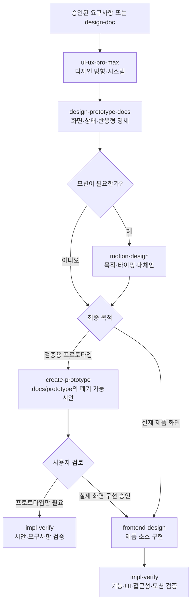
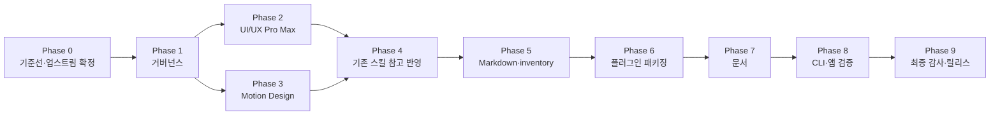

# UI/UX Pro Max 및 Motion Design 업스트림 통합 작업 계획서

> 생성 기준: `skills/impl-doc`
> 프로젝트 유형: AI Agent 사용자 플러그인·외부 업스트림·디자인 하네스 리팩토링
> 대상 저장소: `ai-agent-harness-docs`
> 작성일: 2026-07-30
> 상태: 구현 전 계획
> 선행 계획: `improvement_plan/20260729/플러그인 전환 및 스킬 거버넌스 리팩토링 작업 계획서.md`

---

## 0. 문서 목적

이 문서는 다음 작업을 Phase 단위로 구현·검증·커밋하기 위한 실행 계획이다.

1. UI/UX Pro Max와 Motion Design을 사용자 플러그인의 독립 스킬로 반입한다.
2. 두 업스트림의 유용한 원칙을 기존 디자인·구현·검증 스킬에도 참고형으로 반영한다.
3. 같은 GitHub 원본을 직접 반입형과 참고형으로 동시에 안전하게 최신화할 수 있도록 관리자 거버넌스를 보완한다.
4. 기존 일반 하네스 흐름과 구분되는 디자인 전용 흐름을 추가한다.
5. 디자인 전용 흐름은 프로토타입과 실제 제품 화면 구현의 두 갈래로 분기한다.
6. Caveman과 Ruflo는 하네스 플러그인에 내장하지 않고 별도 설치 대상으로 문서화한다.
7. `README.md`, `.user-docs/Harness_Engineering_Intro.md`, `.user-docs/Harness_Engineering.md`와 관련 운영 문서를 현재 구조에 맞게 갱신한다.
8. 저장소 본체 라이선스와 저작권 귀속을 확정하고, 플러그인 버전 승격 기준을 성문화한다.

이 계획서는 구현 결과물이 아니다. 외부 파일 반입, 보호 자산 추가·변경, 플러그인 재생성은 각 Phase의 승인·검증 조건을 충족한 뒤 수행한다.

---

## 1. 관리자의 의도

### 1-1. 사용자에게 보일 최종 형태

- 사용자는 `ai-agent-harness` 플러그인 하나를 설치한다.
- 설치된 플러그인에서 `ui-ux-pro-max`와 `motion-design`을 독립 스킬로 호출할 수 있다.
- 사용자는 원본 GitHub 저장소를 별도로 clone하거나 그 안의 상대경로를 알 필요가 없다.
- 두 스킬은 Codex와 Claude에서 같은 논리 이름과 같은 핵심 동작을 제공한다.
- 실제 실행은 플러그인에 포함된 승인·고정된 로컬 스냅샷만 사용한다.
- 사용자 실행 중 GitHub `main`을 직접 읽거나 최신 파일을 자동 덮어쓰지 않는다.
- 최신화는 관리자가 이 저장소에서 검토·승인·검증한 뒤 새 플러그인 버전으로 배포한다.

### 1-2. 원본 자료 사용 의도

독립 스킬로 반입할 때 `SKILL.md` 한 파일만 가져오지 않는다.

- UI/UX Pro Max는 검색 스크립트, 디자인 데이터, 빠른 참조, 규칙 자료 등 실제 동작에 필요한 묶음을 함께 관리한다.
- Motion Design은 `director/`, `patterns/`, `reference/`의 전체 지식 묶음을 함께 관리한다.
- 원본 자산은 출처·파일 대응표·선택한 SHA·라이선스·로컬 수정 내용을 기록한다.
- 템플릿, 스크립트, 데이터, references, examples, evals는 보호 자산으로 취급한다.
- 보호 자산의 추가·수정·보완은 영향 보고와 승인을 거친다.
- 보호 자산의 삭제·이동·교체는 별도의 파괴적 변경 승인 없이는 수행하지 않는다.

### 1-3. 직접 반입과 참고 반영의 구분

같은 외부 저장소를 다음 두 방식으로 동시에 사용한다.

| 구분 | 목적 | 사용자 플러그인 포함 | 최신화 방식 |
|---|---|---:|---|
| 직접 반입형 `adapted` | 독립 스킬과 전체 실행 자산 제공 | 포함 | 원본 파일·해시·라이선스·로컬 변환을 비교 |
| 참고형 `reference` | 기존 하네스 스킬에 검증된 원칙만 반영 | 외부 원문은 미포함 | 의미 단위 차이를 비교하고 필요한 원칙만 제안 |

참고형 반영은 다른 스킬 내부의 상대경로나 구현 파일에 결합하지 않는다. 기존 스킬에는 필요한 핵심 원칙과 공개 스킬 이름을 통한 handoff만 남긴다.

### 1-4. 별도 설치 대상

다음 프로젝트는 이번 사용자 플러그인에 포함하지 않는다.

- [Caveman](https://github.com/JuliusBrussee/caveman): 응답 표현과 토큰 사용 방식을 바꾸는 별도 플러그인·스킬이다. 하네스의 설계·검증 계약과 별개로 사용자가 원할 때 원본 안내에 따라 설치한다.
- [Ruflo](https://github.com/ruvnet/ruflo): 다중 에이전트, 메모리, MCP, hook 등을 포함하는 독립 메타 하네스다. 현재 하네스 플러그인 안에 일부만 복제하지 않고 원본 제품으로 별도 설치한다.

문서에는 변하기 쉬운 설치 명령을 임의로 복제하지 않는다. 구현 시점에 원본 README와 설치 문서를 확인하고, 링크와 “최신 설치 방법은 원본을 따른다”는 경계를 명시한다.

---

## 2. 확정 설계

### 2-1. 신규 사용자 스킬

| 로컬 스킬 | 업스트림 | 분류 | 기본 역할 |
|---|---|---|---|
| `ui-ux-pro-max` | [nextlevelbuilder/ui-ux-pro-max-skill](https://github.com/nextlevelbuilder/ui-ux-pro-max-skill) | `reputable-third-party + adapted` | 제품 유형·스타일·색·타이포그래피·레이아웃·UX·접근성·기술 스택에 맞는 디자인 시스템 탐색 |
| `motion-design` | [LottieFiles/motion-design-skill](https://github.com/LottieFiles/motion-design-skill) | `reputable-third-party + adapted` | 애니메이션 목적·타이밍·이징·동작 속성·안무·접근성·성능을 정하는 모션 설계 |

구현 후 사용자 스킬 수는 18종에서 20종으로 바뀐다.

- 사용자 논리 스킬: 20종
- Codex runtime 물리 스킬: 20종
- Claude runtime 물리 스킬: 20종
- runtime agent: 양쪽 모두 0종
- 관리자 스킬: 3종 유지

### 2-2. UI/UX Pro Max 반입 범위

> Phase 0 실측 정정. `src/ui-ux-pro-max/`에는 `SKILL.md`가 없다. 이 트리는
> `templates/base/skill-content.md`와 `templates/platforms/*.json`을 입력으로 쓰는
> 생성기 소스다. 완성된 스킬은 `.claude/skills/ui-ux-pro-max/` 43개 파일이며
> 이쪽이 반입 대상이다. `templates/platforms/`에는 `codex.json`도 이미 있다.
> 생성기 자체는 `cli/`의 TypeScript npm CLI 187개 파일과 얽혀 있어 반입하지
> 않는다. 상세는 `maintainer/upstreams/candidates/ui-ux-pro-max/candidate.json`의
> `generator_decision`에 있다.

구현 시 선택한 안정 태그 또는 commit SHA에서 다음을 확인한다.

- `src/ui-ux-pro-max/**`
- `.claude/skills/ui-ux-pro-max/**`
- `skill.json`
- `.claude-plugin/plugin.json`
- `LICENSE`
- CLI의 자산 동기화·검증 계약

로컬 반입 대상은 실제 독립 스킬에 필요한 다음 묶음이다.

- 플랫폼 중립 `SKILL.md`
- 로컬 검색·디자인 시스템 생성 스크립트
- 제품 유형, 스타일, 색상, 타이포그래피, UX, 차트, 스택 데이터
- 빠른 참조와 품질 규칙
- 로컬 회귀검증용 eval

다음 형제 스킬은 이 Phase에서 함께 반입하지 않는다.

- `banner-design`
- `brand`
- `design-system`
- `design`
- `slides`
- `ui-styling`

이들은 기능 중복, 별도 출처, 라이선스, 의존 관계를 다시 확인해야 하므로 별도 후보로 남긴다.

### 2-3. Motion Design 반입 범위

선택한 commit SHA에서 다음 묶음을 하나의 보호 자산 단위로 반입한다.

- `skills/motion-design/SKILL.md`
- `skills/motion-design/director/**`
- `skills/motion-design/patterns/**`
- `skills/motion-design/reference/**`
- `LICENSE`

원본 자료는 유지하되 로컬 `SKILL.md`와 필요한 보완 자료에는 다음 하네스 기준을 적용한다.

- 모션은 장식보다 정보 전달·상태 변화·방향 안내·피드백 목적을 우선한다.
- 정적 화면이나 기존 디자인 시스템만으로 충분하면 모션 단계를 건너뛸 수 있다.
- 모든 화면에 primary·secondary·ambient 모션을 강제하지 않는다.
- 공공·의료·금융·엔터프라이즈 화면은 낮은 모션 밀도를 기본값으로 둔다.
- `prefers-reduced-motion`과 동등한 대체 전달 수단을 필수 검토한다.
- transform·opacity를 우선하되, 의미와 플랫폼 특성상 다른 속성이 필요한 경우 근거와 성능 검증을 요구한다.
- 기존 제품의 디자인 토큰과 모션 언어가 있으면 새 규칙보다 우선한다.

### 2-4. 업스트림 관계 ID

현재 레지스트리는 source 하나당 `integration_mode` 하나를 가지므로 직접 반입과 참고 반영을 별도 source 관계로 기록한다.

| 관계 ID 제안 | 모드 | 로컬 대상 | 패키징 |
|---|---|---|---:|
| `ui-ux-pro-max-runtime` | `adapted` | `ui-ux-pro-max` | 포함 |
| `ui-ux-pro-max-principles` | `reference` | 기존 디자인·구현·검증 스킬 | 미포함 |
| `lottiefiles-motion-design-runtime` | `adapted` | `motion-design` | 포함 |
| `lottiefiles-motion-design-principles` | `reference` | 기존 디자인·구현·검증 스킬 | 미포함 |

같은 저장소에서 파생된 두 관계는 다음 값을 공유해야 한다.

- repository URL
- accepted upstream tag 또는 commit SHA
- observed commit SHA
- 라이선스 판정 기준
- 최신화 candidate ID 또는 relationship group

한 관계만 새 SHA로 승격되어 직접 반입 내용과 참고 원칙이 어긋나는 상태를 허용하지 않는다.

### 2-5. 기존 스킬 참고 반영

| 기존 스킬 | UI/UX Pro Max에서 참고할 내용 | Motion Design에서 참고할 내용 |
|---|---|---|
| `design-prototype-docs` | 제품 유형, 화면 밀도, 디자인 토큰, 색·타이포그래피·간격, 반응형·접근성 상태 | 모션 목적, 상태 전환, 우선순위, reduced-motion 대체안 |
| `create-prototype` | 선택된 디자인 토큰과 반응형·상태 피드백을 검증 시안에 반영 | 승인된 모션 후보만 시안에서 검증하고 과도한 반복·장식을 피함 |
| `frontend-design` | 기존 디자인 시스템 우선, 스택별 구현 원칙, 접근성·일관성 검사 | 확정된 모션 명세를 제품 코드로 구현하고 성능·reduced-motion을 보장 |
| `impl-verify` | 대비, focus, touch target, overflow, 상태, 토큰 일관성 | reduced-motion, 프레임 저하, 반복 피로, 핵심 정보 전달, 정지 상태를 검증 |

`frontend-design`은 이미 Anthropic 직접 변환본이므로 전체 분류는 계속 `adapted`다. 새 두 출처는 그 스킬의 참고 source 목록에 추가한다. 나머지 세 스킬은 `reference` 분류를 유지한다.

### 2-6. 디자인 전용 하네스 흐름

일반 하네스 전체 흐름 안에 모든 디자인 세부 단계를 강제로 넣지 않는다. UI가 포함된 작업에서 선택하는 별도 흐름을 제공한다.



분기 규칙:

- 프로토타입 분기 산출물은 `.docs/prototype/**`의 폐기 가능한 검증 자료다.
- 프로토타입 HTML/CSS/JS를 실제 제품 소스로 복사하거나 승격하지 않는다.
- 프로토타입 승인 후 실제 구현으로 넘어갈 때는 승인된 디자인 결정과 화면 명세만 `frontend-design`에 전달한다.
- 사용자가 처음부터 실제 화면 구현을 요청하면 `create-prototype`을 강제하지 않는다.
- 실제 화면 구현은 반드시 제품 repository의 기존 컴포넌트·토큰·프레임워크를 먼저 조사한다.
- 두 분기 모두 최종 목적에 맞는 `impl-verify` 검증을 수행한다.

### 2-7. 신규 스킬의 호출 기준

`ui-ux-pro-max`를 호출할 때:

- 새 제품·화면의 디자인 방향을 정할 때
- 색상, 타이포그래피, 간격, 레이아웃, 컴포넌트 밀도를 정할 때
- 제품 유형이나 업종에 맞는 디자인 시스템 후보가 필요할 때
- 기존 화면의 UX·접근성·일관성을 리뷰할 때
- React, Vue, Flutter 등 기술 스택별 UI 원칙이 필요할 때

호출하지 않아도 되는 경우:

- 백엔드 전용 작업
- 기존 디자인 시스템과 화면 명세가 이미 확정되어 단순 구현만 남은 경우
- 디자인 판단 없이 문구나 데이터만 수정하는 경우

`motion-design`을 호출할 때:

- 진입·퇴장·페이지 전환·모달 전환을 설계할 때
- loading·success·error·hover·press 같은 상태 피드백이 필요할 때
- 여러 요소의 등장 순서와 시선을 설계할 때
- 브랜드 모션 언어를 만들 때
- 기존 애니메이션의 속도·이징·피로감·접근성을 리뷰할 때

호출하지 않아도 되는 경우:

- 정적 화면으로 목적이 충분한 경우
- 모션이 요구사항에 없고 추가 효과가 오히려 방해되는 경우
- 기존 제품 모션 명세를 그대로 적용하면 되는 단순 구현

### 2-8. 저장소 라이선스와 저작권 귀속

현재 저장소 루트에는 `LICENSE`가 없다. 라이선스가 없는 공개 저장소의 기본값은
재배포 권한 부재다. 그런데 `README.md`는 marketplace 등록으로 설치를 안내하고
`plugins/**` 산출물과 archive를 커밋한다. 배포를 전제하면서 배포 권한을 명시하지
않은 상태다. 생성된 `plugins/ai-agent-harness/LICENSE`도 "배포 전 소유자가
확정해야 한다"는 플레이스홀더를 유지한다.

이번 작업에서 다음을 확정한다.

| 항목 | 결정 |
|---|---|
| 저장소 본체 라이선스 | Apache-2.0 |
| 저작권자 | `hb9397` |
| 저장소 URL | `https://github.com/hb9397/ai-agent-harness-docs` |
| 서드파티 고지 | 기존 `THIRD_PARTY_NOTICES.md`와 `licenses/` 체계 유지 |

저작권자 표기는 저장소 remote URL에서 유추한 값이 아니라 저장소 소유자가 명시
승인한 값이다.

Apache-2.0을 선택한 이유는 세 가지다.

- 이미 Apache-2.0 파생물 2종(`frontend-design`, `custom-skill-design`)을 담고 있어
  변경 고지와 NOTICE 관행이 저장소에 정착돼 있다.
- 각 기여자가 자신이 허가할 수 있는 특허 청구에 대해 실시권을 제공하는 조항이
  명시되어 있다.
- upstream의 MIT 파일은 Apache-2.0 배포물 안에서 원 라이선스를 유지한 채 함께
  배포할 수 있다.

본체 라이선스가 Apache-2.0이어도 제3자 MIT·Apache 파일은 각각의 원 라이선스를
계속 보존한다. 본체 라이선스는 이 저장소가 직접 저작한 부분에만 적용된다.

Apache-2.0 적용 방식은 다음과 같다.

- 루트 `LICENSE`에는 Apache-2.0 **원문을 편집 없이** 넣는다. 부속서의
  `[yyyy] [name of copyright owner]`는 라이선스 본문을 고치라는 지시가 아니라
  각 소스 파일 헤더에 붙이는 예시 boilerplate다. 이 자리를 채워 넣지 않는다.
- 저작권 표기는 루트 `NOTICE` 또는 개별 파일의 라이선스 헤더에 둔다.
- 루트 `NOTICE` 채택은 선택 사항이다. Apache-2.0의 `NOTICE`는 하위 배포자가
  내용을 계속 전달해야 하는 특수 파일이므로, 기존 `THIRD_PARTY_NOTICES.md`와
  역할을 혼동하지 않는다. 채택한다면 standalone plugin에도 복사하고 validator로
  존재를 확인한다.
- `plugins/ai-agent-harness/LICENSE`에는 루트 `LICENSE` 전문을 builder가 복사한다.
  plugin archive는 독립 배포 단위이므로 "루트 LICENSE 참조와 요약만 넣기"는
  허용하지 않는다.
- 변경 고지 의무는 Apache-2.0 원본에서 파생해 수정한 파일에 적용된다. 이 저장소가
  직접 저작한 파일을 수정할 때마다 고지할 필요는 없다. 현재 대상은
  `frontend-design`과 `custom-skill-design`이며 두 스킬은 이미 이 방식을 따른다.

manifest metadata 오기도 함께 정정한다. 이는 저작권 고지 자체의 오류가 아니라
plugin manifest와 marketplace의 repository metadata 오류다. `build_plugin.py`의
`REPOSITORY_URL` 상수가
`epoko77-ai/ai-agent-harness-docs`로 되어 있어, 생성되는 root marketplace 2종과
plugin manifest 2종의 `author.url`, `homepage`, `repository`, `websiteURL`이 모두
upstream 저작자 계정을 가리킨다. 생성 상수 한 곳을 고치고 재생성한다.
`im-not-ai` upstream 참조로 등장하는 `epoko77-ai`는 정상이므로 변경하지 않는다.

### 2-9. 플러그인 버전 승격 기준

`0.1.0`은 push·tag·GitHub release가 모두 수행되지 않았고 lock의 `released`가
전부 `null`이므로 사용자에게 배포된 적이 없다. 그러나 archive SHA가 다섯 개 감사
산출물에 기록되어 있으므로, 같은 버전 번호로 내용이 다른 산출물을 재빌드하지
않는다.

이번 작업의 릴리스 후보는 `0.2.0`으로 올린다.

현재 `harness-plugin-maintainer`에는 두 manifest가 같은 semantic version을 쓴다는
규칙만 있고 언제 올리는지 기준이 없다. 다음 기준을 관리자 스킬에 성문화한다.

| 변경 성격 | `0.x`에서의 처리 | `1.0` 이후 처리 |
|---|---|---|
| 스킬 이름·호출 계약·필수 입력·설치 표면·산출물 경로의 제거·변경 | 다음 MINOR로 올리고 changelog에 breaking을 명시 | MAJOR |
| 사용자 스킬 추가, 공개 capability 추가, 선택적 산출물 추가 | 다음 MINOR | MINOR |
| 공개 동작을 바꾸지 않는 버그·문서·증적 수정 | PATCH | PATCH |

이 표는 SemVer 규격의 자동 귀결이 아니라 이 저장소의 자체 정책이다. SemVer는
`0.y.z`를 초기 개발 단계로 규정하고 API 안정성을 보장하지 않으므로, `0.x`에서
breaking 변경을 어떤 자리로 올릴지는 규격이 정해주지 않는다. 위 기준을 정책으로
선언하고 관리자 스킬에 고정한다.

`1.0.0`은 배포를 한 번 수행했다는 사실로 결정하지 않는다. 공개 스킬 이름, 호출
계약, 필수 입력, 산출물 경로, 설치 표면이 안정되어 이후 변경을 BREAKING으로
관리할 준비가 됐을 때 정한다. 첫 공개 배포가 바로 `1.0.0`일 수도 있고, 안정화가
끝나지 않았다면 배포 이후에도 `0.x`를 유지한다.

---

## 3. 변경 표면

### 3-1. 사용자 스킬 정본

- `skills/ui-ux-pro-max/**` 신규
- `skills/motion-design/**` 신규
- `skills/design-prototype-docs/**` 참고 원칙·handoff 보완
- `skills/create-prototype/**` 참고 원칙·분기 경계 보완
- `skills/frontend-design/**` 참고 원칙·제품 구현 경계 보완
- `skills/impl-verify/**` 디자인·모션 검증 보완

### 3-2. 관리자 거버넌스 정본

- `maintainer/skills/skill-portfolio-maintainer/**`
- `maintainer/skills/harness-plugin-maintainer/**`
- 필요성이 확인된 경우에만 `maintainer/skills/custom-skill-design/**`
- `maintainer/upstreams/schema.json`
- `maintainer/upstreams/registry.json`
- `maintainer/upstreams/lock.json`
- `maintainer/upstreams/provenance/current-skills.json`
- `maintainer/upstreams/provenance/{신규-source}/**`
- `maintainer/upstreams/candidates/**`
- `maintainer/upstreams/promotions/**`
- `maintainer/skills/skill-portfolio-maintainer/scripts/validate_registry.py`
- `maintainer/inventory/retained-skill-audit.json`
- `maintainer/inventory/markdown-artifact-flow.json`

`validate_registry.py`는 `current-skills.json`의 스킬 수를 `21`로 하드코딩하고,
registry의 모든 source target이 current skill에 존재하는지 lifecycle과 무관하게
검사한다. 신규 source를 등록하는 시점에 두 제약을 함께 풀지 않으면 Phase 1에서
검증이 실패한다. 상세 lifecycle은 CORE-002에 있다.

### 3-3. 플러그인 생성·검증 표면

- `maintainer/plugin/CAPABILITIES.json`
- `maintainer/plugin/runtime-allowlist.json`
- `maintainer/skills/harness-plugin-maintainer/scripts/build_plugin.py`
- `maintainer/skills/harness-plugin-maintainer/scripts/validate_plugin.py`
- `maintainer/skills/harness-plugin-maintainer/templates/plugin-license.md`
- 관련 build·install·release regression fixture
- `plugins/ai-agent-harness/**` 생성물
- release archive·checksum·metadata

`runtime-allowlist.json`은 이름과 달리 일반 실행 권한 스키마가 아니다. 스크립트가
읽는 값은 `claude_runtime_agents`와 `capability_aliases`뿐이다. 스크립트 실행 정책이
필요하면 이 파일을 확장할지 별도 파일을 둘지 먼저 결정한다. PKG-002 참조.

`plugins/ai-agent-harness/**`는 직접 편집하지 않고 builder로 재생성한다.
root marketplace 2종과 plugin manifest 2종도 `build_plugin.py`가 생성하므로
직접 편집하지 않는다.

### 3-4. 관리자 projection

- `.agents/skills/**`
- `.claude/skills/**`

projection은 관리자 정본 변경 후 다음 생성기로만 갱신한다.

```bash
python maintainer/skills/harness-plugin-maintainer/scripts/sync_manager_projections.py
python maintainer/skills/harness-plugin-maintainer/scripts/sync_manager_projections.py --check
```

신규 사용자 스킬은 관리자 projection에 포함하지 않는다.

### 3-5. 운영 문서

필수:

- `README.md`
- `.user-docs/Harness_Engineering_Intro.md`
- `.user-docs/Harness_Engineering.md`

연쇄 갱신:

- `.user-docs/README.md`
- `.user-docs/Plugin_Installation_Guide.md`
- `.user-docs/Imported_Skill_Provenance.md`
- `.user-docs/External_Skill_References.md`
- `.user-docs/Skill_Upstream_Update_Policy.md`
- `maintainer/README.md`
- 관련 `example/**`

역사 문서인 `improvement_plan/20260627/**`는 수정하지 않는다.

### 3-6. 저장소 라이선스·귀속 표면

- `LICENSE` 신규
- `README.md` 라이선스 섹션 신규
- `maintainer/upstreams/registry.json`의 `internal-harness-native` provenance
- `maintainer/skills/harness-plugin-maintainer/scripts/build_plugin.py`의
  `REPOSITORY_URL`과 author 표기
- `.claude-plugin/marketplace.json`, `.agents/plugins/marketplace.json` 생성물
- `plugins/ai-agent-harness/LICENSE` 생성물

루트 `LICENSE`와 `README.md` 라이선스 섹션은 플러그인 산출물에 영향을 주지 않는다.
나머지는 생성 경로를 거치므로 재빌드와 버전 승격을 동반한다.

---

## 4. 공통 승인·보호 규칙

### 4-1. 승인 게이트

| 게이트 | 필요한 시점 | 승인 내용 |
|---|---|---|
| upstream 선정 승인 | 태그·SHA와 반입 범위를 확정할 때 | 저장소, 버전, 파일 범위, 분류 |
| 일반 반영 승인 | staging 분석이 끝났을 때 | 직접 반입·참고 반영 내용 |
| 보호 자산 영향 승인 | scripts, data, references, templates, examples, evals 추가·변경 시 | 추가·수정·보완 파일과 영향 |
| 파괴적 변경 승인 | 기존 또는 업스트림 보호 자산 삭제·이동·교체 시 | 정확한 파일 목록과 복구 방법 |
| 라이선스 승인 | 라이선스가 바뀌거나 재배포 조건이 불명확할 때 | 계속 반입·차단·대체 |
| 본체 라이선스·귀속 승인 | 루트 `LICENSE`, 저작권자, 저장소 URL을 확정할 때 | 라이선스 종류, 저작권자 표기, 생성물 반영 범위 |
| 버전 승격 승인 | 릴리스 후보 버전을 올릴 때 | 승격 단계와 근거 |

신규 스킬 구현은 보호 자산 추가가 예정되어 있으므로 asset-impact approval을 구현 Phase의 선행 조건으로 둔다.

본체 라이선스와 귀속은 §2-8에서 Apache-2.0 / `hb9397` /
`https://github.com/hb9397/ai-agent-harness-docs`로 확정했다.

### 4-2. 금지 사항

- GitHub `main`의 최신 파일을 사용자 runtime에서 직접 다운로드하지 않는다.
- 선택한 SHA가 없는 상태로 packaged upstream을 만들지 않는다.
- UI/UX Pro Max의 형제 스킬을 묵시적으로 포함하지 않는다.
- Motion Design의 references 일부만 골라 원본 전체 규칙처럼 표시하지 않는다.
- 다른 스킬의 내부 상대경로를 기존 스킬에 하드코딩하지 않는다.
- 원본 텍스트를 많이 복사해 놓고 `reference`로 분류하지 않는다.
- prototype 코드를 제품 소스로 복사하지 않는다.
- Caveman이나 Ruflo를 `ai-agent-harness`의 runtime에 포함하지 않는다.
- 사용자 프로젝트에 `.agents/skills`, `.claude/skills`, `skills/`를 생성하지 않는다.
- 생성물인 root marketplace와 plugin manifest를 직접 편집하지 않는다.
- 이미 감사 산출물에 기록된 archive SHA를 가진 버전 번호로 다른 내용을 재빌드하지 않는다.
- upstream LICENSE 원문을 수정하거나 저작권 고지 줄을 바꾸지 않는다.
- `im-not-ai` upstream 참조로 등장하는 `epoko77-ai` 문자열을 일괄 치환하지 않는다.

---

# 5. Phase별 구현 계획

## Phase 0. 기준선·업스트림·라이선스 확정

### 목표

구현 전에 현재 repository 기준선과 두 업스트림의 정확한 안정 버전, 정본 경로, 파일 목록, 라이선스, 실행 의존성을 고정한다.

### 태스크

#### CORE-001 — 현재 하네스 기준선 동결

대상:

- `skills/**`
- `maintainer/plugin/**`
- `maintainer/upstreams/**`
- `plugins/ai-agent-harness/**`
- `README.md`
- `.user-docs/**`

작업:

1. 현재 사용자 스킬 18종과 관리자 스킬 3종 목록을 기록한다.
2. Codex·Claude runtime이 각각 18 skills / 0 agents인지 확인한다.
3. 기존 디자인 흐름과 skill handoff를 기록한다.
4. 현재 Markdown producer 7종을 기록한다.
5. 관련 build·eval·install 검증의 PASS/FAIL을 기준선 보고서에 남긴다.
6. 현재 eval runner 보유 스킬과 미보유 스킬을 구분해 기록한다.
7. 루트 `LICENSE` 부재와 생성물의 저작권 귀속 오기 현황을 기록한다.
8. 감사 산출물에 기록된 archive SHA와 실제 archive 해시의 일치 여부를 기록한다.

단독 검증:

- 현재 정본·projection·plugin 수가 문서와 일치한다.
- 작업 전 worktree의 사용자 변경을 분리해 기록한다.
- `final-readiness-audit.json`과 `.md`가 다른 archive SHA를 들고 있는 현행 drift가
  기준선 보고서에 기록된다.

#### IO-001 — UI/UX Pro Max upstream snapshot 조사

작업:

1. 최신 안정 release 또는 tag를 우선 확인한다.
2. 안정 release가 없거나 부적합하면 branch head SHA를 후보로 제시한다.
3. `src/ui-ux-pro-max/**` 정본과 생성된 `.claude/skills/ui-ux-pro-max/**`를 대조한다.
4. CLI asset sync 검사와 실제 생성 결과를 대조한다.
5. Python 스크립트의 파일 접근, network 사용, process 실행, 의존 패키지를 감사한다.
6. 데이터·references·templates의 전체 목록과 SHA-256을 만든다.
7. LICENSE 파일의 실제 SPDX·저작권자·연도를 확인하고 원문과 hash를 저장한다.
   MIT임을 전제하지 않고 확인 결과로 판정한다.
8. 형제 스킬 6종이 반입 대상에서 제외됐는지 기록한다.

단독 검증:

- 선택 SHA와 모든 관찰 URL이 기록된다.
- 정본과 생성본 사이의 누락 파일이 설명된다.
- “원본 자료 전체 사용”의 범위가 파일 manifest로 증명된다.
- LICENSE가 없거나 예상과 다른 라이선스면 반입 차단 후보로 분리된다.

#### IO-002 — Motion Design upstream snapshot 조사

작업:

1. release/tag 존재 여부를 확인하고 고정할 commit SHA를 선택한다.
2. `skills/motion-design/**` 전체 파일 목록과 SHA-256을 만든다.
3. `director/`, `patterns/`, `reference/`가 모두 포함됐는지 확인한다.
4. 실행 스크립트·외부 네트워크·도구 의존이 있는지 감사한다.
5. LICENSE 파일의 실제 SPDX·저작권자·연도를 확인하고 원문과 hash를 저장한다.
6. `director/`, `patterns/`, `reference/` 안에 제3자 저작물 인용이 있는지 확인한다.
   특히 timing·easing 자료에 Material Design 3와 Apple Human Interface Guidelines의
   구체적인 값이 명시되어 있으므로 인용인지 재작성인지 파일 단위로 판정한다.
   upstream 최상위 MIT는 upstream 작성자가 소유하지 않은 제3자 권리까지 대신
   허가하지 못하므로, 원 저작자와 이용 조건을 분리해 기록한다.

단독 검증:

- 선택 SHA와 원본 트리 manifest가 일치한다.
- 누락된 참고 자료가 없다.
- 제3자 인용이 있는 파일은 라이선스 판정이 개별로 기록된다.

사전 관측: 두 업스트림 모두 저장소 최상위 LICENSE가 MIT다. 이는 조사 시작점일
뿐이므로, 실제 반입할 고정 SHA에서 LICENSE 원문과 hash를 다시 확인한다.

#### LIC-001 — 저장소 본체 라이선스 확정

대상:

- `LICENSE` 신규
- `README.md` 라이선스 섹션
- `maintainer/upstreams/registry.json`의 `internal-harness-native` provenance

작업:

1. 루트에 Apache-2.0 원문을 편집 없이 담은 `LICENSE`를 추가한다. 부속서
   boilerplate 자리를 채우지 않는다.
2. 저작권 표기를 어디에 둘지 결정한다. 루트 `NOTICE` 또는 개별 파일 헤더 중
   하나를 택하고 근거를 기록한다.
3. 루트 `NOTICE`를 채택하는 경우 기존 `THIRD_PARTY_NOTICES.md`와 목적이 어떻게
   다른지 명시하고, plugin에도 복사할 것과 validator 확인 항목을 Phase 6 작업으로
   넘긴다.
4. `README.md`에 본체 Apache-2.0과 서드파티 고지 참조를 설명하는 섹션을 추가한다.
5. `internal-harness-native`의 `provenance.license_spdx`를 `null`에서
   `Apache-2.0`으로 바꾼다.
6. 생성물에 영향을 주는 `REPOSITORY_URL`·author 표기·플러그인 LICENSE 템플릿
   변경은 이 태스크에서 수행하지 않고 Phase 6으로 넘긴다.

단독 검증:

- `LICENSE`가 루트에 존재하고 Apache-2.0 원문과 byte 단위로 일치한다.
- 저작권 표기 위치가 결정되고 기록된다.
- 이 태스크는 `plugins/**` 산출물과 archive 해시를 바꾸지 않는다.
- `build_plugin.py --check`와 `validate_plugin.py`가 계속 통과한다.

#### AUD-001 — 감사 증적의 역사·현재 구분

대상:

- `maintainer/plugin/final-readiness-audit.json`
- `maintainer/plugin/final-readiness-audit.md`

작업:

1. `final-readiness-audit`의 archive SHA가 실제 archive 및 나머지 다섯 산출물과
   다른 원인을 판정한다.
2. 옛 해시가 `0.1.0` 이전 빌드의 역사 기록인지, 갱신 누락으로 생긴 현재 증적의
   오류인지 구분한다.
3. 역사 기록이면 역사임을 문서에 명시하고 현재 증적과 분리한다. 오류면 현재
   archive 기준으로 정정한다.
4. 어느 쪽이든 `0.2.0` 재빌드 전에 확정한다. 구분하지 않은 채 재빌드하면 옛
   해시의 성격을 나중에 판정할 수 없다.

단독 검증:

- 감사 문서의 각 해시가 역사 기록인지 현재 증적인지 명시된다.
- 현재 증적으로 남는 해시는 실제 archive와 일치한다.

#### TEST-001 — Phase 0 기준선 검증

검증:

```bash
python maintainer/skills/skill-portfolio-maintainer/evals/run_evals.py
python maintainer/skills/harness-plugin-maintainer/evals/run_evals.py
python maintainer/skills/harness-plugin-maintainer/scripts/build_plugin.py --check
python maintainer/skills/harness-plugin-maintainer/scripts/validate_plugin.py
python maintainer/skills/harness-plugin-maintainer/scripts/sync_manager_projections.py --check
git diff --check
```

### Phase 0 완료 기준

- [ ] 두 업스트림의 선택 버전과 SHA가 확정됐다.
- [ ] 원본 정본·생성본·실행 자산 대응표가 있다.
- [ ] 라이선스와 재배포 가능 여부가 확인됐다.
- [ ] Motion Design 자료의 제3자 인용 라이선스가 파일 단위로 판정됐다.
- [ ] 보호 자산 영향 목록이 승인 대기 상태로 분리됐다.
- [ ] 현재 18-skill 기준선 검증 결과가 저장됐다.
- [ ] eval runner 보유·미보유 스킬 목록이 기록됐다.
- [ ] 루트 Apache-2.0 `LICENSE`가 추가되고 산출물 해시는 변하지 않았다.
- [ ] 감사 산출물의 archive SHA drift가 역사 증적과 현재 증적으로 구분됐다.

---

## Phase 1. 업스트림 거버넌스와 관리자 스킬 보완

### 목표

같은 GitHub 저장소를 직접 반입형과 참고형으로 동시에 추적하되 두 관계의 SHA가 어긋나지 않도록 관리자 workflow를 확장한다.

### 태스크

#### CORE-002 — registry relationship group 계약 추가

대상:

- `maintainer/upstreams/schema.json`
- `maintainer/upstreams/registry.json`
- registry loader·validator

작업:

1. 같은 repository의 관계들을 묶는 명시적 group 또는 pair 필드를 설계한다.
2. group 안의 active 관계는 accepted·observed SHA가 같아야 한다.
3. repository URL과 license 판정이 불일치하면 검증을 실패시킨다.
4. runtime `adapted` 관계와 principles `reference` 관계가 동시에 최신화 candidate에 포함되도록 한다.
5. reference 관계가 plugin license packaging 대상으로 잘못 들어가지 않도록 유지한다.
6. `validate_registry.py`의 `current-skills.json` 스킬 수 하드코딩 `21`을 inventory
   파생값으로 바꾼다. 값이 `23`이 되는 시점은 Phase 1이 아니라 promotion 이후다.
7. candidate lifecycle을 함께 처리한다. 현재 validator는 registry의 모든 source에
   대해 target skill이 `current-skills.json`의 `skills`에 있어야 한다고 검사하며,
   이 루프는 `internal-harness-native`만 건너뛸 뿐 lifecycle을 보지 않는다.
   `ui-ux-pro-max`와 `motion-design`이 아직 존재하지 않는 Phase 1에서 신규 source를
   등록하면 target missing 오류가 난다. lifecycle이 `candidate`인 source는 current
   target 존재 검사를 유예하거나 candidate inventory와 대조하도록 바꾼다.
8. `skills`가 비어 있어야 한다는 candidates 검사와의 관계를 함께 정리한다.
9. `schema.json`에 group 필드를 추가할 때 `schema_version` 패턴이 `^1\.0\.0$`로
   고정되어 있으므로, 선택 필드로 추가할지 버전을 올릴지 먼저 결정한다.

lifecycle 단계는 다음과 같다.

| 시점 | source lifecycle | current skill 수 | plugin logical user skill |
|---|---|---:|---:|
| Phase 1 | 신규 4종 `candidate` | 21 | 18 |
| Phase 2·3 완료 후 promotion | `active`로 전환 | 23 | 18 |
| Phase 6 | `active` 유지 | 23 | 20 |

Phase 1에서 즉시 23이 되지 않는다. canonical skill과 eval이 완성되고 promotion을
거친 뒤에 23이 된다.

단독 검증:

- 같은 group의 SHA 불일치 fixture가 실패한다.
- 정상 pair fixture는 통과한다.
- 서로 다른 저장소의 독립 source에는 영향을 주지 않는다.
- 스킬 수가 바뀌어도 검증 스크립트를 다시 수정할 필요가 없다.

`build_plugin.py`는 packaged source를 `integration_mode`로 자동 파생하므로
`reference` 관계는 이미 licenses 패키징에서 구조적으로 제외된다. 5번은 신규 계약
구현이 아니라 회귀 fixture로 이 성질을 고정하는 작업이다.

#### CORE-003 — `skill-portfolio-maintainer` workflow 보완

대상:

- `maintainer/skills/skill-portfolio-maintainer/SKILL.md`
- 관련 scripts, prompts, templates, evals

작업:

1. 한 upstream에서 여러 integration relationship을 만들 수 있음을 설명한다.
2. 조사·staging은 GitHub upstream 하나씩 수행한다는 원칙을 유지한다.
3. 같은 upstream의 direct/reference 관계는 하나의 candidate로 원자적 승인·승격한다.
4. 직접 반입 파일 diff와 참고 원칙 semantic diff를 한 보고서 안에서 구분한다.
5. protected asset 영향과 destructive diff를 관계별·파일별로 분리한다.
6. 원본 자산의 추가·수정·삭제와 로컬 보완 자산을 구분한다.
7. UI/UX Pro Max와 Motion Design용 smoke prompt·행동 fixture를 registry에서 검증한다.

#### CORE-004 — `harness-plugin-maintainer` 계약 보완

대상:

- `maintainer/skills/harness-plugin-maintainer/SKILL.md`
- 관련 scripts·evals

작업:

1. 사용자 스킬 수를 하드코딩된 18이 아니라 capability inventory에서 파생하도록 개선한다.
2. 구현 완료 후 양 runtime의 20종 일치와 manager skill 미누출을 검증한다.
3. packaged `adapted` source의 LICENSE·NOTICE·lock closure를 두 신규 source에 적용한다.
4. references·data·scripts가 archive에서 누락되지 않는지 asset manifest를 검증한다.
5. 플랫폼별 runtime 내용이 byte-equivalent인지 허용된 manifest 차이를 제외하고 비교한다.
6. eval runner coverage manifest를 `maintainer/inventory/skill-eval-coverage.json`에
   신설하고 이 경로를 정본으로 고정한다. 현재 `run_all_skill_evals.py`는
   `*/evals/run_evals.py` glob 자동 탐색이라 runner가 없는 스킬이 조용히 검사
   대상에서 빠지고 로그에는 전체 통과로 보인다. 모든 스킬에 runner를 강제하는
   대신, manifest에 등록된 **필수 runner의 누락만** 실패시킨다.
7. 이번 범위의 필수 runner를 manifest에 등록한다. 신규 `ui-ux-pro-max`,
   `motion-design`, 신설 대상 `design-prototype-docs`, `frontend-design`,
   확장 대상 `create-prototype`, `impl-verify`가 해당한다.
8. §2-9의 버전 승격 기준을 `harness-plugin-maintainer` 정본에 성문화하고,
   그것이 SemVer 귀결이 아니라 저장소 자체 정책임을 함께 기록한다.

#### CORE-005 — `custom-skill-design` 영향 감사

작업:

1. direct/reference 이중 관계, 전체 자산 반입, 공개 skill-name handoff 규칙이 이미 표현되는지 점검한다.
2. 부족한 일반 설계 규칙이 있을 때만 관리자 정본을 보완한다.
3. UI/UX Pro Max나 Motion Design 전용 내용은 `custom-skill-design`에 넣지 않는다.

#### IO-003 — 신규 provenance skeleton과 candidate 생성

대상:

- `maintainer/upstreams/registry.json`
- `maintainer/upstreams/provenance/**`
- `maintainer/upstreams/candidates/**`

작업:

1. 네 source relationship을 등록한다.
2. 두 GitHub upstream별 하나의 candidate bundle을 만든다.
3. file-map에서 `verbatim`, `modified`, `excluded`, `local-only`, `reference-only`를 파일 단위로 기록한다.
4. NOTICE와 LICENSE를 직접 반입 관계에 연결한다.
5. 참고형 관계에는 copied file이 없음을 검증한다.

#### TEST-002 — 관리자 workflow 회귀검증

검증:

```bash
python maintainer/skills/skill-portfolio-maintainer/evals/run_evals.py
python maintainer/skills/harness-plugin-maintainer/evals/run_evals.py
python maintainer/skills/harness-plugin-maintainer/scripts/sync_manager_projections.py
python maintainer/skills/harness-plugin-maintainer/scripts/sync_manager_projections.py --check
git diff --check
```

추가 fixture:

- paired SHA 불일치 차단
- reference-only 관계의 plugin package 제외
- protected asset 무승인 승격 차단
- 같은 upstream의 관계 중 하나만 승격하는 요청 차단
- 두 upstream을 한 candidate로 섞는 요청 차단

### Phase 1 완료 기준

- [ ] direct/reference 관계를 같은 upstream snapshot으로 묶을 수 있다.
- [ ] 관리자 스킬의 책임 경계가 유지된다.
- [ ] projection에는 관리자 3종만 존재한다.
- [ ] 사용자 신규 스킬은 아직 plugin runtime에 포함되지 않는다.
- [ ] 신규 source 4종이 `candidate` lifecycle이고 current skill 수는 21이다.
- [ ] candidate source가 존재하지 않는 target 때문에 검증을 실패시키지 않는다.

---

## Phase 2. `ui-ux-pro-max` 독립 스킬 구현

### 목표

UI/UX Pro Max의 검색·데이터·참조 기능을 보존하면서 Codex·Claude 공용 하네스 규칙에 맞는 플랫폼 중립 사용자 스킬을 만든다.

### 선행 승인

- upstream 선정 승인
- 일반 반영 승인
- scripts·data·references·templates·evals 추가에 대한 보호 자산 영향 승인

### 태스크

#### CORE-006 — 플랫폼 중립 `SKILL.md` 작성

대상:

- `skills/ui-ux-pro-max/SKILL.md`

계약:

1. frontmatter에 특정 모델, agent fork, Claude 전용 경로를 넣지 않는다.
2. 자연어 디자인 요청과 명시 호출을 모두 지원한다.
3. 기존 프로젝트의 디자인 시스템과 컴포넌트를 먼저 조사한다.
4. 제품 유형, 업종, 대상 사용자, 플랫폼, 기술 스택, 접근성 요구를 확인한다.
5. 검색 결과를 디자인 결정과 근거로 변환한다.
6. 디자인을 직접 구현할지, 문서화할지, 프로토타입으로 검증할지 구분한다.
7. 실제 제품 구현은 공개 이름 `frontend-design`으로 handoff한다.
8. 프로토타입 문서는 `design-prototype-docs`, 검증 시안은 `create-prototype`으로 handoff한다.
9. 모션이 필요할 때만 공개 이름 `motion-design`을 제안한다.
10. 외부 sibling skill의 내부 파일을 요구하지 않는다.

#### IO-004 — 검색·데이터·참조 자산 반입과 경로 중립화

대상:

- `skills/ui-ux-pro-max/scripts/**`
- `skills/ui-ux-pro-max/data/**`
- `skills/ui-ux-pro-max/references/**`
- 필요한 플랫폼 중립 보조 자산

작업:

1. 선택 SHA의 full manifest와 로컬 tree를 대응시킨다.
2. `${CLAUDE_PLUGIN_ROOT}`나 `.claude/skills` 전용 경로를 제거한다.
3. 스크립트 자신의 위치를 기준으로 data·references를 찾도록 한다.
4. Python 표준 라이브러리 외 의존성이 있는지 검증한다.
5. network·package install·임의 process 실행을 금지한다.
6. Windows와 POSIX에서 경로·UTF-8·줄바꿈을 검증한다.
7. upstream 제외 파일과 제외 이유를 provenance에 기록한다.

#### IO-005 — 디자인 시스템 산출물 계약

기본 동작:

- 대화창에 후보와 근거를 보고한다.
- 사용자 승인 없이 프로젝트 파일을 만들지 않는다.

명시적으로 저장할 때:

```text
.docs/design-system/{project-slug}/MASTER.md
.docs/design-system/{project-slug}/pages/{page-slug}.md
```

규칙:

1. 기존 파일이 있으면 diff를 제시하고 승인 전 덮어쓰지 않는다.
2. 화면별 override는 MASTER와 다른 값만 기록한다.
3. 색상 hex, token 이름, 숫자, 경로, 표는 문서 개선 단계의 보호 토큰으로 잠근다.
4. 저장 후 구조 검증을 수행한다.
5. 직접 호출이 최외곽 Markdown producer일 때 한 번만 `humanize-korean` 개선안을 제안한다.
6. 상위 producer 안에서 호출되면 child handoff를 억제한다.

#### TEST-003 — `ui-ux-pro-max` 단위·행동 검증

`skills/ui-ux-pro-max/evals/run_evals.py`를 신설한다. 기존 runner는 정적 계약 회귀
검사이며 SKILL.md와 참조 자료의 계약 문구가 이후 편집으로 사라지면 실패한다.
이 스킬은 문구 검사만으로 부족하다. 실제 Python 검색 실행, data·references 경로
해소, network 호출 차단을 확인하는 행동 fixture를 함께 실행한다.

필수 fixture:

- SaaS dashboard 디자인 시스템 추천
- 공공·의료 화면의 접근성 우선 추천
- 기존 디자인 토큰이 있는 프로젝트에서 기존값 우선
- stack별 검색
- 검색 결과 0건과 잘못된 domain 처리
- project slug와 page slug 경로 탈출 차단
- 기존 MASTER 무승인 덮어쓰기 차단
- Markdown producer handoff 1회 보장
- Python command 후보 탐지
- Windows·POSIX 경로
- network 호출 없음

Codex·Claude smoke prompt:

- 디자인 방향만 요청
- design-system 저장 요청
- 기존 화면 UX 리뷰
- 프로토타입 handoff 요청
- 실제 화면 handoff 요청

### Phase 2 완료 기준

- [ ] 독립 호출이 가능하다.
- [ ] 원본 검색·데이터·참조 자산이 manifest로 닫혀 있다.
- [ ] Claude 전용 경로가 없다.
- [ ] 사용자 승인 없는 파일 생성·덮어쓰기가 없다.
- [ ] protected asset 검증과 eval이 통과한다.

---

## Phase 3. `motion-design` 독립 스킬 구현

### 목표

Motion Design의 전체 원본 지식 묶음을 보존하고, 하네스의 접근성·성능·저밀도 기본값을 적용한 플랫폼 중립 스킬을 만든다.

### 선행 승인

- upstream 선정 승인
- 일반 반영 승인
- director·patterns·reference·evals 추가에 대한 보호 자산 영향 승인

### 태스크

#### CORE-007 — 플랫폼 중립 `SKILL.md` 작성

대상:

- `skills/motion-design/SKILL.md`

계약:

1. 모션의 목적을 먼저 분류한다.
2. 정보 전달, 상태 변화, 공간 관계, 피드백, 브랜드 표현 중 무엇인지 밝힌다.
3. 정적 대안이 충분하면 모션을 생략한다.
4. 기존 제품의 모션 토큰과 컴포넌트를 먼저 조사한다.
5. timing, easing, property, choreography, repetition을 결정한다.
6. reduced-motion 대체안과 정지 상태를 함께 설계한다.
7. 구현 프레임워크를 임의로 바꾸지 않는다.
8. 실제 제품 구현은 `frontend-design`, 검증은 `impl-verify`로 공개 handoff한다.

#### IO-006 — 원본 지식 묶음 반입

대상:

- `skills/motion-design/director/**`
- `skills/motion-design/patterns/**`
- `skills/motion-design/reference/**`

작업:

1. upstream 파일을 원칙적으로 보존한다.
2. 수정한 파일은 modified로, 로컬 보완은 local-only로 기록한다.
3. 원본에 대한 번역·재구성·규칙 약화 지점을 semantic mapping에 기록한다.
4. 링크와 내부 참조가 plugin runtime에서도 해소되는지 검사한다.
5. 일부 파일을 제외할 경우 기능 영향과 이유를 승인 항목으로 분리한다.

#### IO-007 — 모션 명세 산출물 계약

기본 동작:

- 대화창에 모션 결정표와 구현·검증 기준을 보고한다.

명시적으로 저장할 때:

```text
.docs/design-system/{project-slug}/motion/{screen-or-component}.md
```

필수 항목:

- 목적
- trigger와 상태
- 대상 요소
- duration·delay·easing
- 사용할 속성
- 반복 조건
- reduced-motion 대체안
- 성능 위험
- 검증 기준

저장·덮어쓰기·humanize handoff는 `ui-ux-pro-max`와 같은 승인형 producer 계약을 따른다.

#### TEST-004 — `motion-design` 단위·행동 검증

`skills/motion-design/evals/run_evals.py`를 신설한다. 계약 회귀 검사 성격은
TEST-003과 같다.

필수 fixture:

- form loading → success → error
- modal entrance·exit
- dashboard 다중 요소 등장
- 엔터프라이즈 화면의 낮은 모션 밀도
- reduced-motion 대체안
- 모션이 불필요한 정적 화면에서 skip
- 과도한 ambient loop 차단
- layout-triggering 속성의 근거·성능 검증 요구
- 기존 제품 모션 토큰 우선
- 저장 경로 탈출과 무승인 덮어쓰기 차단

### Phase 3 완료 기준

- [ ] `director/`, `patterns/`, `reference/` 전체가 manifest로 닫혀 있다.
- [ ] 모션 강제 규칙이 로컬 안전 기준에 맞게 조정됐다.
- [ ] 접근성·성능·정적 대안이 필수 검토된다.
- [ ] Codex·Claude에서 같은 핵심 결과를 낸다.

---

## Phase 4. 기존 하네스 스킬 참고 반영

### 목표

신규 스킬을 독립적으로 쓸 수 있게 하면서 기존 디자인 흐름에서도 필요한 원칙과 handoff가 자연스럽게 연결되도록 한다.

### 태스크

#### CORE-008 — `design-prototype-docs` 보완

작업:

1. 디자인 시스템 존재 여부를 먼저 확인한다.
2. 필요 시 `ui-ux-pro-max` 결과를 입력으로 받는다.
3. 화면별 토큰, 상태, 반응형, 접근성, 빈 상태·오류 상태를 명세한다.
4. 모션이 필요한 후보와 목적만 식별하고 필요 시 `motion-design`으로 넘긴다.
5. 신규 스킬 내부 파일을 직접 읽도록 요구하지 않는다.
6. `skills/design-prototype-docs/evals/run_evals.py`를 신설한다. motion handoff 문구
   유지와 신규 스킬 내부 경로 미참조를 계약으로 고정한다.

#### CORE-009 — `create-prototype` 보완

작업:

1. 승인된 디자인 시스템과 화면 명세를 사용한다.
2. 모션은 승인된 후보만 구현한다.
3. prototype 분기와 real-screen 분기의 경계를 출력에 명시한다.
4. `.docs/prototype/**` 산출물을 제품 코드로 복사하지 않는 규칙을 강화한다.
5. 사용자의 시각·UX 승인 결과를 구조화해 반환한다.
6. 기존 `skills/create-prototype/evals/run_evals.py`를 확장한다. 승인된 모션만
   구현하는 규칙과 분기 경계 문구를 계약으로 추가한다.

#### CORE-010 — `frontend-design` 보완

`frontend-design`은 `SKILL.md` 단일 파일이고 보호 자산이 없다. 여기에 두 업스트림의
디자인·모션 원칙을 본문으로 풀어쓰면 원문 복사 압력이 커지고, 디자인 판단 주체가
신규 2종과 중복된다. 원칙을 복제하지 않고 입력 계약만 추가한다.

작업:

1. 기존 진입 라우팅 표는 그대로 둔다. 이 표는 사용자의 **최종 산출물**을 기준으로
   담당 스킬을 가르는 분류다. `ui-ux-pro-max`와 `motion-design`은 최종 산출물이
   아니라 이 스킬의 **선행 입력**이므로 축이 다르다. 같은 표에 섞으면 문서 설계
   화면과 디자인 결정 단계가 같은 층위로 보인다.
2. 별도 “선행 입력” 절을 신설하고 우선순위를 두 축으로 나눠 명시한다. 디자인과
   모션은 입력 출처가 다르므로 한 줄 우선순위로 묶지 않는다.

   | 축 | 1순위 | 2순위 | 입력이 없을 때 |
   |---|---|---|---|
   | 디자인 | 기존 제품의 디자인 시스템·컴포넌트·토큰 | 승인된 `ui-ux-pro-max` 결정 | 이 스킬의 로컬 기본 구현 기준 |
   | 모션 | 기존 제품의 모션 언어 | 승인된 `motion-design` 명세 | 접근 가능한 최소 상태 피드백 |

   충돌하면 구현하지 말고 근거를 보고한다.
3. 현재 구현 기준의 `모션: 의미 있는 1~2개의 핵심 애니메이션에 집중` 항목을
   교체한다. 이 문장은 지금 이 스킬이 모션을 자체 판단하는 유일한 지점이다.
   `motion-design` 명세가 있을 때만 해당 모션을 구현하고, 없으면 4번 기준을
   따르는 규칙으로 바꾼다.
4. prototype 코드를 재사용하지 않고 승인된 결정만 재해석한다.
5. 접근성, responsive, reduced-motion, 성능 기준을 구현 완료 조건으로 둔다.
6. 상세 원칙은 upstream에서 옮기지 않고 provenance 문서에 source·section mapping만
   기록한다.
7. 출처와 변경 고지 절에는 중앙 provenance 문서 링크만 둔다. source 목록을
   SKILL.md 본문에 중복 기재하지 않는다. 실제 관계는 registry와 current-skills가
   정본이고 validator가 대조하므로, 본문 중복은 drift만 만든다.
8. `skills/frontend-design/evals/run_evals.py`를 신설한다. 선행 입력 두 축, 모션
   조건부 구현 규칙, 라우팅 표 유지, `allowed-tools` 고정을 계약으로 고정한다.
   source 목록은 runner가 아니라 registry validator가 확인한다.

`skills/frontend-design/references/`를 새로 만들 경우 다음 조건을 모두 만족해야
한다.

- 독립적으로 작성한 구현 체크리스트여야 한다.
- upstream을 축약하거나 재서술한 문서면 `reference`가 아니라 `adapted` 검토
  대상이며, 승인·NOTICE·라이선스 영향을 다시 판단한다.
- `references/` 신설 자체가 보호 자산 추가이므로 asset-impact approval을 선행한다.

#### CORE-011 — `impl-verify` 보완

검증 매트릭스에 다음을 추가한다.

- 디자인 토큰 일관성
- 색 대비와 focus 표시
- keyboard·touch target
- viewport별 overflow·density
- loading·empty·error·success 상태
- reduced-motion
- 모션의 목적과 반복 조건
- 프레임 저하·layout thrashing 위험
- 프로토타입과 제품 source의 경계

기존 `skills/impl-verify/evals/run_evals.py`를 확장해 추가된 검증 항목이 이후
편집으로 사라지지 않도록 계약으로 고정한다. 기존 trust-boundary 계약 검사는
그대로 유지한다.

#### IO-008 — provenance와 reference mapping 갱신

대상:

- `maintainer/upstreams/provenance/current-skills.json`
- 신규 source provenance
- `.user-docs/External_Skill_References.md`
- `.user-docs/Imported_Skill_Provenance.md`

규칙:

- 기존 스킬에 반영한 원칙을 upstream 파일·섹션 단위로 기록한다.
- 상당한 원문·표·체크리스트를 복사하지 않는다.
- 복사가 필요해지면 해당 파일은 `adapted`로 재분류하고 승인·NOTICE 영향을 다시 검토한다.

`reference` 유지 여부는 분량이 아니라 성질로 판단한다. 분량 임계값은 저작권상
허용 여부도, 독립 작성 여부도, 의미적 파생 여부도 보장하지 못하므로 두지 않는다.
현행 `references/reference-mode.md`는 upstream 파일·번역문·요약문을 로컬 source로
반입하지 않는 것을 이미 정책으로 정하고 있다. 그 기준을 그대로 따른다.

- 외부 문장, 표, 체크리스트, 코드를 복사하지 않는다.
- 공개 skill-name handoff와 로컬 입력 계약만 작성한다.
- upstream의 구체적 문구나 구조를 번역·축약·재구성하면 `adapted` 검토 대상이며
  승인·NOTICE·라이선스 영향을 다시 판단한다.
- provenance에는 source·section과 채택한 개념만 기록한다.

#### TEST-005 — 디자인 workflow 통합 fixture

이 검증은 개별 스킬의 `evals/run_evals.py`에 넣지 않는다. 여러 스킬에 걸친 분기와
handoff를 확인하는 것이므로 harness 통합 fixture로 배치한다. 개별 runner는 자기
스킬의 계약 문구만 지키고, 분기 전체의 정합성은 통합 fixture가 책임진다.

시나리오:

1. 프로토타입만 요청
2. 처음부터 실제 화면 구현 요청
3. 프로토타입 승인 후 실제 화면 구현
4. 모션 없는 정적 화면
5. 모션이 있는 제품 화면
6. 기존 디자인 시스템이 있는 프로젝트
7. 디자인 시스템이 없는 신규 프로젝트

검증:

- 공개 skill-name handoff만 사용한다.
- child producer가 중복 humanize handoff를 만들지 않는다.
- prototype 코드가 제품 source에 복사되지 않는다.
- 실제 화면 구현에는 `frontend-design`이 적용된다.
- 양 분기 끝에 목적에 맞는 `impl-verify`가 수행된다.

### Phase 4 완료 기준

- [ ] 신규 독립 스킬과 기존 스킬의 역할이 중복되지 않는다.
- [ ] prototype·real-screen 분기가 동작 계약으로 고정됐다.
- [ ] reference 분류가 provenance와 실제 문구에 일치하고 정량 기준을 넘지 않는다.
- [ ] `frontend-design`의 선행 입력 절이 라우팅 표와 분리되어 있다.
- [ ] 필수 runner 6종이 coverage manifest에 등록되고 모두 통과한다.
- [ ] 분기 전체 정합성은 개별 runner가 아니라 통합 fixture가 검증한다.

---

## Phase 5. Markdown 산출물·inventory·보호 자산 정합성

### 목표

신규 스킬이 선택적으로 만드는 Markdown을 기존 승인형 문서 개선 흐름에 안전하게 연결한다.

### 태스크

#### CORE-012 — Markdown producer inventory 확장

대상:

- `maintainer/inventory/markdown-artifact-flow.json`
- `maintainer/skills/harness-plugin-maintainer/scripts/build_plugin.py`
- `maintainer/skills/harness-plugin-maintainer/scripts/validate_plugin.py`

작업:

1. `ui-ux-pro-max`를 조건부 Markdown producer로 등록한다.
2. `motion-design`을 조건부 Markdown producer로 등록한다.
3. producer 수와 이름을 JSON inventory에서 파생한다.
4. 하드코딩된 producer 배열을 제거하거나 inventory와 불일치하면 실패시킨다.
5. bundle fingerprint, outermost owner, child suppression, 승인 후 재검증 계약을 적용한다.

#### IO-009 — 보호 토큰과 구조 검증 정의

UI/UX 문서 보호 항목:

- hex·RGB·HSL
- CSS variable·design token
- font family·weight
- spacing·breakpoint
- stack·component 이름
- 표·코드 fence·경로·링크

Motion 문서 보호 항목:

- duration·delay
- easing curve
- property 이름
- trigger·state
- reduced-motion 조건
- 성능 budget

#### TEST-006 — producer 중복·변조 회귀검증

fixture:

- standalone 신규 스킬 저장
- 상위 workflow 내부 신규 스킬 호출
- 같은 bundle 재시도
- 일부 파일만 개선 승인
- 보호 토큰이 바뀐 개선안
- 개선 반영 뒤 원 producer 검증 실패

### Phase 5 완료 기준

- [ ] 신규 조건부 producer가 inventory에 반영됐다.
- [ ] 중복 개선 제안이 없다.
- [ ] 디자인·모션의 기계적 값이 문서 개선으로 변하지 않는다.

---

## Phase 6. 플러그인 패키징·라이선스·runtime 검증

### 목표

사용자 스킬 20종과 신규 upstream 자산을 Codex·Claude runtime에 결정적으로 패키징한다.

### 태스크

#### PKG-001 — capability와 skill count 갱신

작업:

1. `CAPABILITIES.json`의 논리 사용자 스킬에 신규 2종을 추가한다.
2. build·validator의 18 하드코딩을 20 또는 inventory 파생값으로 바꾼다.
3. 양 runtime의 skill 이름과 파일 hash를 비교한다.
4. runtime agent 0, alias 0을 유지한다.
5. 관리자 스킬 누출을 차단한다.
6. 릴리스 후보 버전을 §2-9에 따라 `0.2.0`으로 올린다.

#### PKG-002 — runtime allowlist와 실행 자산 검증

작업:

1. `runtime-allowlist.json`의 책임 범위를 먼저 확정한다. builder·validator·regression이
   실제로 읽는 값은 `claude_runtime_agents`와 `capability_aliases`뿐이고, 최상위
   `source` 키는 어떤 스크립트도 읽지 않는다. 이 파일은 일반 실행 권한 스키마가
   아니라 Claude agent·alias 제한에 가깝다. 현재 책임을 유지할지 결정한다.
2. 일반 스크립트 보안 정책이 필요하다고 판단되면 별도
   `maintainer/plugin/runtime-execution-policy.json`을 검토한다. 스킬별 실행 파일,
   interpreter, network·subprocess·package install 허용 여부를 기록한다.
3. 기존 `runtime-allowlist.json`을 일반 실행 권한 스키마로 전환하기로 결정한 경우에만
   다중 source 구조로 바꾸고 migration fixture를 추가한다. 전환을 기본 전제로 두지
   않는다.
4. UI 검색 스크립트 실행에 필요한 최소 권한만 명세한다.
5. 제한 없는 `Bash`를 frontmatter에서 사전 승인하지 않는다.
6. Python 실행 파일 탐지와 설치 누락 안내를 플랫폼 중립으로 만든다.
7. 스킬이 package manager로 Python을 자동 설치하지 않도록 한다.
8. Motion Design은 instruction/reference-only runtime임을 검증한다.

#### PKG-003 — LICENSE·NOTICE·lock closure

작업:

1. 두 직접 반입 source의 LICENSE를 plugin `licenses/`에 포함한다.
2. THIRD_PARTY_NOTICES에 원본, 고정 SHA, 수정 여부를 기록한다.
3. reference relationship은 copied package license 목록에 중복 생성하지 않는다.
4. `UPSTREAMS.lock.json`에는 packaged source와 실제 artifact hash를 닫는다.
5. 라이선스 hash 불일치 시 build를 실패시킨다.
6. `plugins/ai-agent-harness/LICENSE`가 루트 `LICENSE` 전문을 담도록 바꾼다.
   현재는 `templates/plugin-license.md`를 복사하며 그 내용은 "배포 전 소유자가
   확정해야 한다"는 플레이스홀더다. plugin archive는 독립 배포 단위이므로 루트
   참조나 요약 고지로 대체하지 않는다. 전문을 두 곳에서 중복 관리하지 않도록
   builder가 루트 `LICENSE`를 복사하게 하고, 템플릿은 제거하거나 서드파티 안내
   전용으로 축소한다.
7. 루트 `NOTICE`를 채택한 경우 plugin에도 복사하고 validator에 존재 검사를 넣는다.
8. `build_plugin.py`의 `REPOSITORY_URL`을 `https://github.com/hb9397/ai-agent-harness-docs`로
   바꾸고 author 표기를 `hb9397`로 맞춘다. 이 상수 하나에서 root marketplace 2종과
   plugin manifest 2종의 `author.url`·`homepage`·`repository`·`websiteURL`이 모두
   파생된다.
9. `im-not-ai` upstream 참조의 `epoko77-ai`는 그대로 둔다.

두 직접 반입 source는 `maintainer/upstreams/provenance/{source-id}/`에 `NOTICE.md`와
`LICENSE`를 나란히 둬야 한다. `build_plugin.py`가 `notice_path`의 상위 경로에서
`LICENSE`를 찾고, `license_spdx`·`license_url`·`license_sha256`·`notice_path` 중
하나라도 비면 build를 실패시킨다.

#### PKG-004 — plugin 생성물 재생성

작업:

1. canonical `skills/**`에서 runtime을 생성한다.
2. archive와 checksum을 재생성한다.
3. 같은 source로 두 번 build해 tree manifest와 archive hash가 같은지 확인한다.
4. generated 파일을 직접 수정한 흔적이 없는지 확인한다.
5. root marketplace 2종과 plugin manifest 2종이 새 저장소 URL로 재생성됐는지
   확인한다.
6. 새 archive는 `0.2.0` 이름으로 만들고 `0.1.0` archive와 그 해시를 기록한 감사
   산출물은 역사 기록으로 보존한다.

#### TEST-007 — plugin 자동 검증

검증:

```bash
python maintainer/skills/harness-plugin-maintainer/scripts/run_all_skill_evals.py
python maintainer/skills/harness-plugin-maintainer/scripts/build_plugin.py
python maintainer/skills/harness-plugin-maintainer/scripts/build_plugin.py --check
python maintainer/skills/harness-plugin-maintainer/scripts/validate_plugin.py
python maintainer/skills/harness-plugin-maintainer/scripts/freeze_manager_inventory.py --check
python maintainer/skills/harness-plugin-maintainer/scripts/run_release_regression.py
git diff --check
```

### Phase 6 완료 기준

- [ ] 양 runtime에 같은 20개 사용자 스킬이 있다.
- [ ] UI/UX Pro Max의 data·scripts·references가 archive에 있다.
- [ ] Motion Design의 director·patterns·reference가 archive에 있다.
- [ ] LICENSE·NOTICE·lock이 닫혀 있다.
- [ ] plugin LICENSE가 플레이스홀더가 아니다.
- [ ] 생성물의 저작권 귀속이 실제 저장소를 가리킨다.
- [ ] 릴리스 후보 버전이 `0.2.0`이다.
- [ ] plugin build가 결정적이다.

---

## Phase 7. README와 하네스 문서 최신화

### 목표

사용자와 관리자가 신규 디자인 흐름, 독립 스킬, 참고 관계, 별도 설치 대상을 혼동하지 않도록 문서를 갱신한다.

### 태스크

#### CORE-013 — `README.md` 갱신

반영 내용:

1. 사용자 스킬 18종을 20종으로 변경한다.
2. 스킬 목록에 `ui-ux-pro-max`, `motion-design`을 추가한다.
3. 일반 하네스 흐름은 기존 순서를 유지한다.
4. 별도 “디자인 작업 흐름”을 추가한다.
5. 프로토타입과 실제 화면 두 분기를 Mermaid로 표시한다.
6. prototype 코드 비승격 원칙을 명시한다.
7. 두 신규 스킬의 호출 예시를 Codex·Claude 형식으로 제공한다.
8. Caveman·Ruflo는 별도 설치 대상으로 설명하고 GitHub 링크를 건다.
9. 직접 반입형과 참고형의 차이를 짧게 설명한다.
10. 릴리스 후보 버전과 archive 이름을 `0.2.0`으로 갱신한다.
11. 라이선스 섹션을 둔다. 본체는 Apache-2.0이고 서드파티 고지는
    `THIRD_PARTY_NOTICES.md`와 플러그인 `licenses/`를 따른다고 설명한다.
    LIC-001에서 추가한 내용이 이미 있으면 버전·스킬 수 변경에 맞춰 정합만 맞춘다.

#### CORE-014 — `.user-docs/Harness_Engineering_Intro.md` 갱신

중학생도 이해할 수 있는 수준으로 다음을 설명한다.

- UI/UX Pro Max: 화면의 색·글꼴·배치·사용 편의성을 정하는 “디자인 도서관과 검색 도구”
- Motion Design: 화면이 움직이는 이유·속도·순서를 정하는 “움직임 설계 가이드”
- 프로토타입: 버려도 되는 시험 화면
- 실제 화면: 제품 source에 구현되고 유지보수되는 화면
- 왜 prototype 코드를 그대로 제품에 넣지 않는지
- 모션을 항상 넣지 않는 이유
- Caveman과 Ruflo가 하네스에 포함되지 않는 이유

#### CORE-015 — `.user-docs/Harness_Engineering.md` 갱신

상세 반영:

1. 정본·책임 경계와 사용자 스킬 수 갱신
2. 일반 흐름과 디자인 전용 흐름의 관계
3. 두 갈래 분기의 입력·산출물·승인 gate·검증
4. 각 신규 스킬의 호출·skip 조건
5. 공개 skill-name handoff 계약
6. 디자인 시스템과 모션 명세의 선택적 저장 경로
7. Markdown producer·humanize handoff
8. direct/reference upstream 최신화 구조
9. Caveman·Ruflo 별도 설치 링크와 경계

#### CORE-016 — 연쇄 문서 갱신

대상:

- `.user-docs/README.md`
- `.user-docs/Plugin_Installation_Guide.md`
- `.user-docs/Imported_Skill_Provenance.md`
- `.user-docs/External_Skill_References.md`
- `.user-docs/Skill_Upstream_Update_Policy.md`
- `maintainer/README.md`
- 관련 `example/**`

규칙:

- 현재 문서에서 18종으로 고정된 표현을 20종으로 갱신한다.
- `0.1.0`으로 고정된 현행 표현을 `0.2.0`으로 갱신한다.
- 과거 release evidence와 역사 계획의 숫자는 역사 기록으로 보존한다.
- 직접 반입과 참고 관계를 같은 것으로 설명하지 않는다.
- 별도 설치 도구가 이 플러그인의 필수 의존성인 것처럼 쓰지 않는다.
- `.user-docs/Imported_Skill_Provenance.md`에는 직접 반입 2종을,
  `.user-docs/External_Skill_References.md`에는 참고 2종을 각각 기록한다.

#### TEST-008 — 문서 검증

검증:

- 모든 로컬 Markdown 링크 확인
- Mermaid syntax 확인
- 현재 문서의 stale 18-skill 표현 검색
- 신규 스킬 이름·GitHub URL 검색
- Caveman·Ruflo가 runtime 포함 대상으로 표현되지 않았는지 검색
- prototype → product code 복사 금지 문구 확인
- Codex·Claude 호출 예시 확인

예상 검색:

```bash
rg -n "18종|18개|18 skills" README.md Docs maintainer/README.md
rg -n "ui-ux-pro-max|motion-design" README.md Docs maintainer
rg -n "JuliusBrussee/caveman|ruvnet/ruflo" README.md Docs
git diff --check
```

### Phase 7 완료 기준

- [ ] 세 핵심 문서에 디자인 전용 분기가 있다.
- [ ] 프로토타입과 실제 화면의 차이가 명확하다.
- [ ] 신규 스킬 호출·skip 조건을 찾을 수 있다.
- [ ] Caveman·Ruflo 링크와 별도 설치 경계가 있다.
- [ ] 현재 문서의 skill count가 일치한다.

---

## Phase 8. Codex·Claude CLI와 앱 실행 검증

### 목표

파일이 설치되는 것과 실제 모델이 스킬 계약을 수행하는 것을 구분해 네 실행 표면에서 검증한다.

### 태스크

#### TEST-009 — 자동 설치 smoke

검증:

```bash
python maintainer/skills/harness-plugin-maintainer/scripts/smoke_cli_install.py
python maintainer/skills/harness-plugin-maintainer/scripts/verify_install_surfaces.py --check
```

확인:

- marketplace 등록
- plugin 설치
- cache에 20개 사용자 스킬
- 관리자 스킬 0개
- 두 신규 스킬의 전체 자산
- uninstall·cleanup

#### TEST-010 — Codex CLI 수동 행동 검증

예시:

```text
$ui-ux-pro-max
기존 React 관리자 화면의 디자인 시스템을 제안해줘.
현재 토큰이 있으면 우선하고 파일은 아직 만들지 마.
```

```text
$motion-design
이 결제 버튼의 loading → success → error 전환을 설계해줘.
reduced-motion 대체안과 성능 검증 기준도 포함해줘.
```

증적:

- 호출 인식
- references·data 사용 근거
- 무승인 쓰기 없음
- 공개 handoff
- 결과 캡처·버전·설치 경로

#### TEST-011 — Codex 앱 수동 행동 검증

시나리오:

- 신규 화면 디자인 방향
- 디자인 시스템 저장 승인·거절
- 프로토타입 분기
- 실제 화면 분기
- 모션 skip

#### TEST-012 — Claude Code CLI 수동 행동 검증

예시:

```text
/ai-agent-harness:ui-ux-pro-max
의료 예약 화면의 접근성 중심 디자인 시스템을 제안해줘.
```

```text
/ai-agent-harness:motion-design
모달 열기/닫기 동작을 설계하고 motion 감소 환경을 포함해줘.
```

#### TEST-013 — Claude 앱·Desktop Code 수동 행동 검증

지원되는 설치 표면에서 다음을 확인한다.

- 두 신규 스킬 목록 노출
- 명시 호출
- reference asset 접근
- prototype·real-screen routing
- 결과·버전·환경 증적

### Phase 8 판정 규칙

- 자동 설치 성공을 실제 모델 동작 성공으로 대신하지 않는다.
- CLI 성공을 앱 성공으로 대신하지 않는다.
- 지원되지 않는 앱 표면은 `SKIP`이 아니라 근거가 있는 `미지원`으로 기록한다.
- 네 표면의 수동 증적이 모두 충족되기 전에는 release-ready로 표시하지 않는다.

### Phase 8 완료 기준

- [ ] CLI 자동 설치 smoke가 통과했다.
- [ ] Codex CLI·앱 증적이 있다.
- [ ] Claude Code CLI·앱 증적이 있다.
- [ ] 두 신규 스킬의 직접 호출과 디자인 분기 흐름이 확인됐다.

---

## Phase 9. 최종 감사·릴리스 후보

### 목표

구현, upstream, plugin, 문서, 실제 실행 증적을 하나의 릴리스 후보로 닫는다.

### 태스크

#### TEST-014 — 전체 회귀검증

검증:

```bash
python maintainer/skills/skill-portfolio-maintainer/evals/run_evals.py
python maintainer/skills/harness-plugin-maintainer/evals/run_evals.py
python maintainer/skills/harness-plugin-maintainer/scripts/run_all_skill_evals.py
python maintainer/skills/harness-plugin-maintainer/scripts/build_plugin.py --check
python maintainer/skills/harness-plugin-maintainer/scripts/validate_plugin.py
python maintainer/skills/harness-plugin-maintainer/scripts/smoke_cli_install.py
python maintainer/skills/harness-plugin-maintainer/scripts/verify_install_surfaces.py --check
python maintainer/skills/harness-plugin-maintainer/scripts/freeze_manager_inventory.py --check
python maintainer/skills/harness-plugin-maintainer/scripts/run_release_regression.py
python maintainer/skills/harness-plugin-maintainer/scripts/sync_manager_projections.py --check
git diff --check
```

#### TEST-015 — 의도 재감사

질문:

1. 두 신규 스킬은 독립 호출 가능한가?
2. 원본의 실행·참조 자산을 실제로 모두 패키징하는가?
3. direct/reference 관계가 같은 SHA를 가리키는가?
4. 기존 스킬은 외부 내부 경로에 결합되지 않았는가?
5. 디자인 전용 흐름이 일반 흐름을 불필요하게 복잡하게 만들지 않는가?
6. 프로토타입과 실제 제품 source 경계가 지켜지는가?
7. 모션을 필요 없는 화면에 강제하지 않는가?
8. 사용자 프로젝트에 local skill 디렉터리를 만들지 않는가?
9. Caveman·Ruflo가 별도 설치 대상으로만 설명되는가?
10. 문서·manifest·실제 runtime의 skill count가 모두 20인가?
11. 저장소 본체와 플러그인의 라이선스가 모두 확정되어 플레이스홀더가 없는가?
12. 생성물의 저작권 귀속이 실제 저장소 소유자를 가리키는가?
13. 스킬 수와 producer 수가 하드코딩이 아니라 inventory에서 파생되는가?
14. eval runner가 없어서 검사에서 빠지는 사용자 스킬이 보고되는가?

#### PKG-005 — 릴리스 후보 갱신

작업:

1. semantic version은 §2-9 기준에 따라 `0.2.0`으로 확정한다.
2. release metadata, archive, checksum, audit를 갱신한다.
3. packaged upstream SHA와 artifact hash를 기록한다.
4. 자동·수동 증적의 PASS·FAIL·미지원 상태를 구분한다.
5. unresolved FAIL이 있으면 release-ready를 차단한다.
6. **같은 현재 릴리스 후보를 설명하는 모든 증적**이 동일한 archive SHA를 기록하는지
   교차검증하고, 불일치하면 릴리스를 차단한다. 역사 증적은 다른 해시를 갖는 것이
   정상이므로 검사 대상에서 제외한다. 현행 `0.1.0`에서 `final-readiness-audit`만
   옛 해시를 들고 있는데도 검증 전체가 통과했다. 감사 문서 갱신 경로가 검증되지
   않는 상태를 이번 릴리스에서 닫는다. AUD-001에서 옛 해시가 오류로 판정되면
   현재 파일을 정정하고 옛 값은 Git 이력에만 남긴다.
7. Phase 8의 수동 증적 부채는 신규 2종만이 아니라 기존 스킬 몫까지 포함한다.
   `0.1.0`에서 미해결로 남은 네 표면 증적을 함께 갚지 않으면 `0.2.0`도
   release-ready가 될 수 없다.

### Phase 9 완료 기준

- [ ] 전체 자동 검증이 통과했다.
- [ ] 네 실행 표면의 판정이 기록됐다.
- [ ] upstream·license·NOTICE·lock이 닫혔다.
- [ ] 문서와 runtime이 같은 흐름과 수를 설명한다.
- [ ] release-ready 여부가 증적에 따라 결정됐다.

---

## 6. Phase 의존 관계



Phase 2와 Phase 3은 Phase 1 완료 후 서로 독립적으로 구현할 수 있다. 다만 이 저장소의 운영 방식에 따라 각 Phase를 구현·검증·커밋한 뒤 다음 Phase로 진행한다.

---

## 7. 구현 후 최종 상태

### 사용자 스킬 구성

| 영역 | 스킬 |
|---|---|
| 설치·기반 | `harness-setup`, `harness-bootstrap`, `git-scoped-account` |
| 설계·컨텍스트 | `design-doc`, `context-doc`, `doc-audit` |
| UI/UX 설계 | `ui-ux-pro-max`, `design-prototype-docs` |
| 모션 설계 | `motion-design` |
| 프로토타입 | `create-prototype` |
| 제품 UI | `frontend-design` |
| 구현 계획·점검 | `impl-doc`, `impl-fe-be-doc`, `impl-reuse-scan`, `impl-verify` |
| 품질·커밋 | `multi-review`, `pre-commit`, `commit`, `code-comment` |
| 문서 개선 | `humanize-korean` |

합계: 사용자 스킬 20종

### 관리자 스킬 구성

| 스킬 | 역할 |
|---|---|
| `custom-skill-design` | 신규·기존 스킬 구조와 행동 설계 |
| `skill-portfolio-maintainer` | 외부 upstream 탐색·분류·staging·승인·승격·rollback |
| `harness-plugin-maintainer` | Codex·Claude runtime 생성·검증·설치 시험·릴리스 |

관리자 스킬은 사용자 plugin payload에 포함하지 않는다.

---

## 8. 전체 완료 정의

- [ ] UI/UX Pro Max가 전체 실행 자산을 가진 독립 사용자 스킬로 동작한다.
- [ ] Motion Design이 전체 director·patterns·reference를 가진 독립 사용자 스킬로 동작한다.
- [ ] 두 스킬이 Codex·Claude에서 같은 논리 이름과 핵심 계약을 가진다.
- [ ] 두 upstream의 direct/reference 관계가 같은 고정 SHA로 관리된다.
- [ ] 기존 네 스킬에 필요한 원칙만 참고형으로 반영됐다.
- [ ] `README.md`, `Harness_Engineering_Intro.md`, `Harness_Engineering.md`에 디자인 전용 흐름이 있다.
- [ ] 디자인 흐름이 프로토타입과 실제 화면 두 갈래로 분기한다.
- [ ] prototype 코드는 제품 source로 승격되지 않는다.
- [ ] 모션은 조건부이며 접근성·성능·정적 대안을 검토한다.
- [ ] 사용자 스킬 수가 문서·inventory·plugin·runtime에서 20으로 일치한다.
- [ ] 사용자 프로젝트에 local skill 디렉터리를 생성하지 않는다.
- [ ] Caveman과 Ruflo는 GitHub 링크가 있는 별도 설치 대상으로만 설명된다.
- [ ] LICENSE·NOTICE·provenance·lock·protected asset 승인이 닫혔다.
- [ ] 저장소 루트에 Apache-2.0 원문이 편집 없이 들어간 `LICENSE`가 있다.
- [ ] 저작권 표기 위치가 결정되고 승인된 저작권자 이름이 쓰였다.
- [ ] 루트 `NOTICE` 파일의 채택 여부와 목적이 문서에 명시됐다.
- [ ] plugin archive가 라이선스 전문을 자체적으로 담는다.
- [ ] 플러그인 LICENSE 플레이스홀더가 제거됐다.
- [ ] 생성물의 저작권 귀속이 `hb9397/ai-agent-harness-docs`를 가리킨다.
- [ ] 릴리스 후보 버전이 `0.2.0`이고 승격 기준이 관리자 스킬에 성문화됐다.
- [ ] 모든 감사 산출물이 같은 archive SHA를 기록한다.
- [ ] 필수 eval runner가 coverage manifest로 관리되고 누락이 실패로 드러난다.
- [ ] 버전 승격 기준이 SemVer 귀결이 아닌 자체 정책으로 명시됐다.
- [ ] 자동 설치와 실제 Codex·Claude CLI·앱 행동 증적이 구분되어 기록됐다.
- [ ] 전체 회귀검증이 통과하고 unresolved FAIL이 없다.

